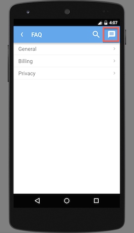
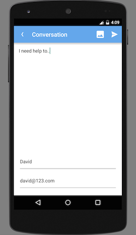

# 快速开始

##	安装SDK

HelpCenter是依赖于LAS Core SDK之上的服务，在安装和使用HelpCenter SDK之前，请确保您的项目已经安装LAS Core SDK. 您可以在 [LAS Core SDK安装向导](...)中获取更多信息。

####	获取SDK

[下载HelpCenter Android SDK](...)
	
####	添加SDK

######	Android Studio 

1. 	打开Android Studio，点击“File” >> "New.." >> "Import Module"，选择所下载SDK的"LAS HelpCenter"目录
2. 	打开需要使用HelpCenter的Module，在其build.gradle中添加如下依赖：

	```java
	dependencies {
	    compile project(':LAS Helpcenter')
	}
	```

	
##	配置LAS项目

###	连接项目与LAS应用
	
在Application的onCreate()方法中，调用`LASConfig.initialize`来设置您应用的Application ID 和 REST API Key：
	
```java
	import android.app.Application;
	import as.leap.LASConfig;

	public class MyApplication extends Application {
		@Override
		public void onCreate() {
		    super.onCreate();
		    LASConfig.initialize(this, "{{appid}}", "{{restapikey}}");
		}
	}
```
	
###	权限配置

在AndroidManifest中，给予应用以下权限：
	
```java
	<uses-permission android:name="android.permission.READ_PHONE_STATE" />
   	<uses-permission android:name="android.permission.ACCESS_NETWORK_STATE" />
   	<uses-permission android:name="android.permission.INTERNET" />
```
	
	权限|用途|是否必需
	---|---|---
	`ACCESS_NETWORK_STATE`|		检测联网方式，区分用户设备使用的是2G、3G或是WiFi| 必需
	`READ_PHONE_STATE`| 	获取用户设备的IMEI，通过IMEI和mac来唯一的标识用户| 必需
	`INTERNET`| 	允许应用程序联网，以便向我们的服务器端发送数据| 必需
	
##	快速测试

#### 测试LAS Core SDK

为了测试项目是否已经注连接上LAS应用及其LAS云服务，我们可以向Application的onCreate()方法中添加以下代码：

```java
import android.app.Application;
import as.leap.LASConfig;
import as.leap.LASDataManager;
import as.leap.LASObject;

public class MyApplication extends Application {
    @Override
    public void onCreate() {
        super.onCreate();
        LASConfig.initialize(this, "{{appid}}", "{{restkey}}");
        
        //测试项目配置：
        LASObject testObject = new LASObject("People");
        testObject.put("Name", "David Wang");
        LASDataManager.saveInBackground(testObject);
    }
}
```

该段测试代码试图向Cloud Data中创建一个“CLASS” － “People”，并存入一条数据。我们将在管理界面的“开发者中心” -> “云存储” 中发现：


表明通过客户端，向应用下的Cloud Data存入数据成功。至此，LAS SDK的安装与配置完成。

#### 测试LAS HelpCenter SDK
为了测试项目能否使用LAS HelpCenter服务，我们可以向Application的onCreate()方法中添加以下代码：

```java
LASHelpCenter.openFaqs(MainActivity.this);
```

运行后，您将在安卓测试设备中看见：



点击右上角“提交反馈”按钮，填写反馈信息：



最后，点击右上角“发送”按钮，您将收到来自Leap Cloud的回应消息：


表明，Leap Cloud已经成功接受您的反馈信息。测试成功。

至此，HelpCenter SDK的安装与配置完成。请移步至[HelpCenter SDK使用教程](...)以获取HelpCenter的详细功能介绍以及使用方法，开启LAS云服务使用之旅。