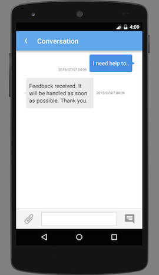

##	Install the SDK

HelpCenter relies on MaxLeap Core SDK, please check if your project has installed MaxLeap Core SDK already before install and use HelpCenter SDK. You can check more details in [MaxLeap Core SDK Guide](ML_DOCS_LINK_PLACEHOLDER_SDK_QUICKSTART_ANDROID).

1.	Get project template:

<a class="download-sdk" href="...">Download MaxLeap HelpCenter project template</a>

2.	Open project template

	Android Studio

	1. 	Open Android Studio and click “Import project”
	2. 	Enter template root directory and choose “build.gradle”
	3. 	Click Next Step by default until done

Eclipse

	1.	Open Eclipse and click "File" -> "Import..."
	2. 	Choose "General"-> "Existing Projects into Workspace"
	3. 	Select “Select root directory”, enter workspace directory and choose MLStarterProject in project list.

##	Connect project to MaxLeap app

Call `MaxLeap.initialize` from the `onCreate` method of your Application class to set your Application ID and REST API Key:

```java
import android.app.Application;
import com.maxleap.MaxLeap;

public class MyApplication extends Application {
	@Override
	public void onCreate() {
		super.onCreate();
		MaxLeap.initialize(this, "{{appid}}", "{{restapikey}}");
	}
}
```

##	Config Permission

Give app following permissions in AndroidManifest:


```java
<uses-permission android:name="android.permission.READ_PHONE_STATE" />
<uses-permission android:name="android.permission.ACCESS_NETWORK_STATE" />
<uses-permission android:name="android.permission.INTERNET" />
```

Permission|Purpose|If Necessary
---|---|---
`ACCESS_NETWORK_STATE`|		Check the network access, 2G, 3G or WiFi| Necessary
`READ_PHONE_STATE`| 	Check IMEI of device and identify user with unique IMEI and mac| Necessary
`INTERNET`| 	Allow network access to send data to our server| Necessary

##	Quick Test

1. Test MaxLeap Core SDK

We can add following code in onCreate() method in Application to test if the project is already registered to MaxLeap：

```java
import android.app.Application;
import com.maxleap.MaxLeap;
import com.maxleap.MLDataManager;
import com.maxleap.MLObject;

public class MyApplication extends Application {
	@Override
	public void onCreate() {
		super.onCreate();
		MaxLeap.initialize(this, "{{appid}}", "{{restapikey}}");

		//Test Project Configuration：
		MLObject testObject = new MLObject("People");
		testObject.put("Name", "David Wang");
		MLDataManager.saveInBackground(testObject);
	}
}
```

This piece of data is trying to create a “class” － “People” in Cloud Data and save a data to it. We can check "Dev Center" -> "Data" and find:


It indicates that saving data to Cloud Data in the app with client is completed, so does the installation and configuration of MaxLeap SDK.

2. Test MaxLeap HelpCenter SDK
 We can add following code in onCreate() method in Application to test if MaxLeap HelpCenter works in the project:

```java
MLHelpCenter.openFaqs(MainActivity.this);
```

Run it and you can see this in Andriod test device:


Click the top right "Submit Feedback" button and fill feedback message:


At last, click the top right "send" button and you can receive a message from MaxLeap:



It indicates that MaxLeap has received your feedback message. Test succeeded.

## Next Step

At this point, you have completed the installation and configuration of HelpCenter SDK. Please check [HelpCenter SDK Guide](ML_DOCS_GUIDE_LINK_PLACEHOLDER_ANDROID#SUPPORT_ZH) to find more details about MaxLeap.