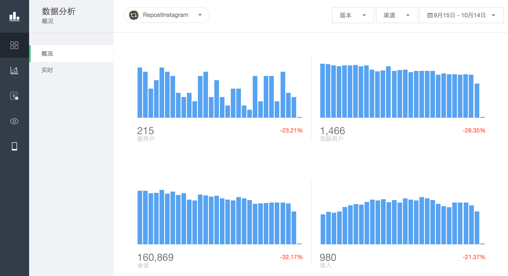
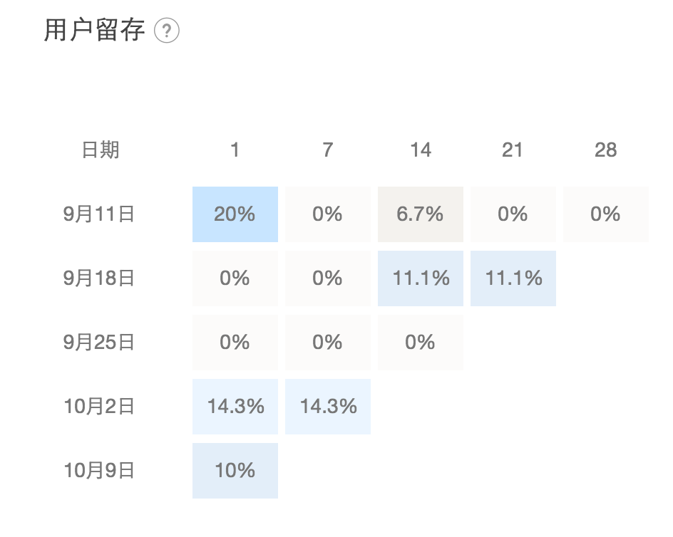
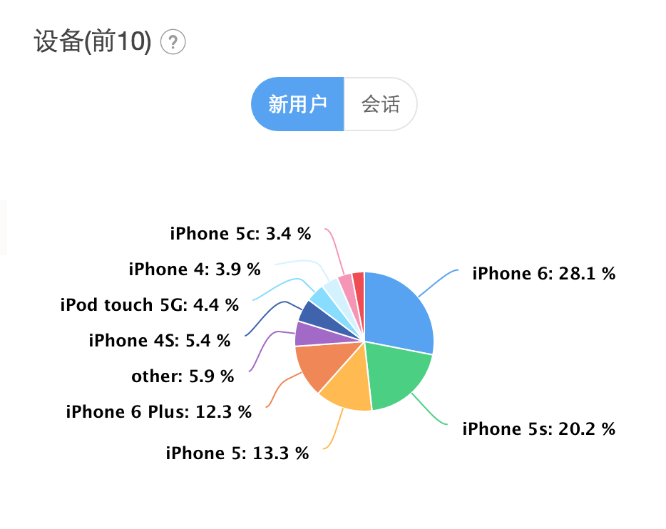
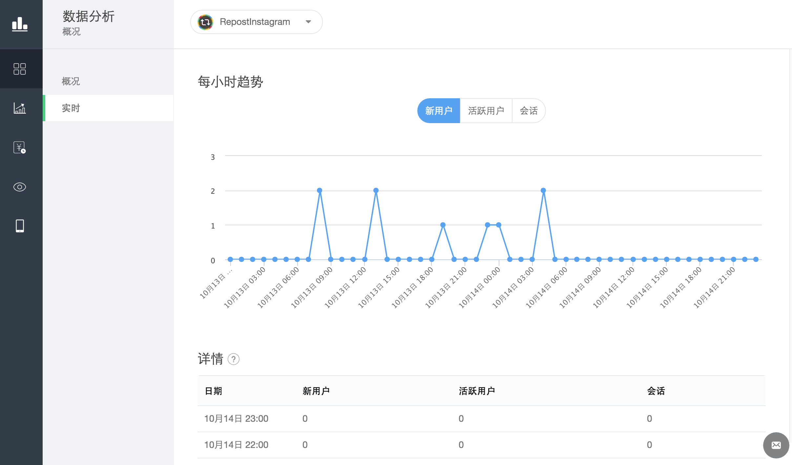
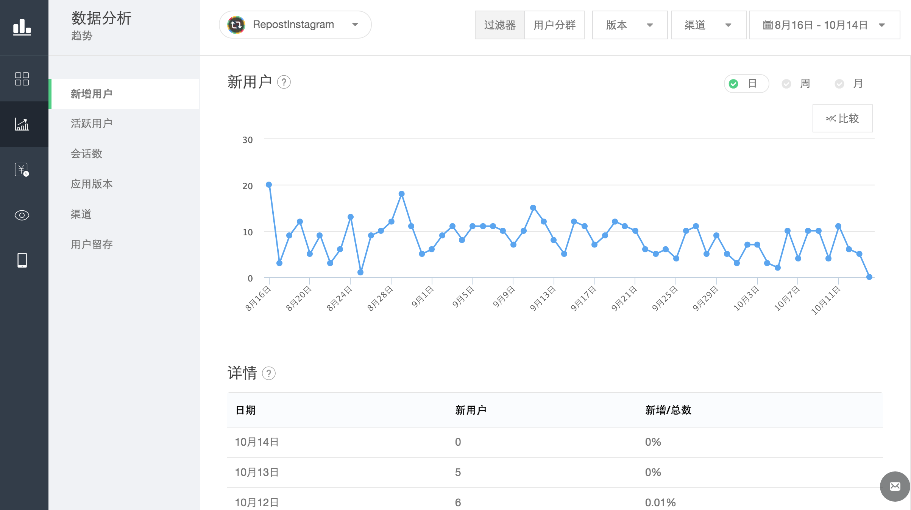
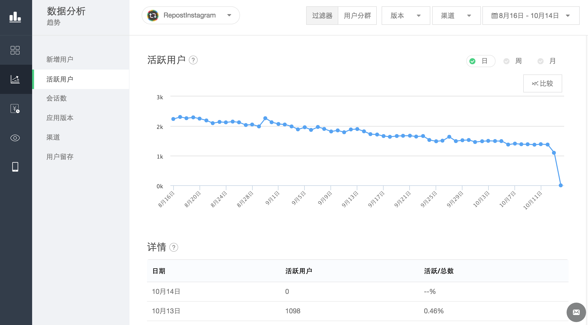
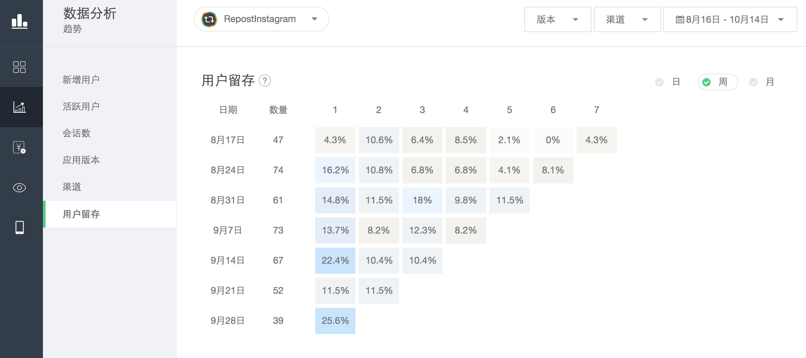

# Leap Cloud Analytics

## Introduction

###	What is Leap Cloud Analytics

Leap Cloud Analytics collects all kinds of data of apps and users with clients and Cloud Data. With professional analytics in Leap Cloud, there would be a final operator-oriented report. 

###	Why is Leap Cloud Analytics Necessary

Leap Cloud Analytics is a real-time free and professional mobile apps Analytics Service. It provides multi-analysis of operation status, deep knowledge of typical users and advice on optimizing operating strategies, which will finally realize：

*	Comprehend the operation status and trend: from New Users, Active Users, Sessions and App Versions to User bahevior, User attributes and behavioral features, we provide all kinds of indexes to help you understand your app's operation and iteration effect. 
*	Fully perceive user bahevior: Reproduce the behavior of each user and keep abreast of their engagement, retention and conversion.
*	Improve user experience: Define user segments and customize user experience for differenct segments.
*	Promote app revenue: Track consumer behavior, make marketing strategies and maximize the marketing effect.

###	How does Leap Cloud Analytics Work

Leap Cloud Anaylytics SDK helps us track user behavoir and provides data for cloud analytics service, which includes:

1.  Collect information automatically(like terminal info, etc.)
2.  Track Sessions
2.  Customize events
3.  Track comsuption
4.  Track page view
5.  Collect installation information

Leap Cloud Analytics helps you learn about your users and their behavoir, thus make more effective marketing strategies with functions as summarized as below:

1. **User Analytics: ** incluing tread, retention, terminal, and etc.
2. **User Behavior Analytics: ** including user engagement, user actions, etc. 
3. **Payment Analytics: ** including Revenue, etc.

#### Advantages: 

1.    Best practice: Leap Cloud provides you with the most competitive analytics parameters and model, and is verified by apps with billions of users. 
2.    Precise Segment: analyze the attributes and behavoir of your segments. 
3.    Plenty Reports: Leap Cloud provides a whole set of complete and intuitive reports through operator's eyes:

    We can also customize the data displayed in reports with filters below:

    * Segments: check index variation in specific segment.
    * Filters: for specific app versions and channels.
    * Timeframe: choose the specifc time span.	

**If you want to learn more about Leap Cloud Analytics Service SDK, please check [iOS Guide － Analytics](../../iOS/Guide/Analytics.md) or [Android Guide － Analytics](../../Android/Guide/Analytics.md)。**

## Overview

DashBoard shows: Main indexes(New Users, Active Users and Sessions) and Revenue variation.

###  Overview of Main Indexes Yesterday

 

Mainly includes：three main indexes yesterday(New Users, Active Users and Sessions), Revenue amount and Growth Rate.
	
###  Index Variation Along With Time

 

###  Index Geographical Distribution

 
    
###  User Retention

Includes user retention for the last 5 weeks

 

#####  Device information

 

## Trend

Trend shows how indexes(New Users, Active Users and Sessions) varies in different dimensions.

The informaiton you can get from here includes but is not limited to:

* User growth and user behavoir
* Most popular app versions

### Real Time

Qucik show: The hourly trend of those 3 main indexes in 48 hours.

 

###New Users/Active Users/Sessions

 

###App Versions/Channels

Show the amount distribution of those 3 main indexes among different app versions/channels.

 

## Retention

Retention report shows the retention rate after new users come in different given times.

> The informaiton you can get from here includes but is not limited to:

> * The start-up date of loyal users and their loyalty
> * The churn date of new users

1.  Retention Rate

 

## Payment

Payment shows the variation of main payment indexes(Revenue, Order Count, Paying Users Count, First Payment and Penetrance).

> The informaiton you can get from here includes but is not limited to:

> * The variance of payment
> * The purchase rules(When will the purchase reach its peak after the first payment) 
> * Purchasing power/potential purchasing power

1.  Trend
    
    Shows the variation of main payment indexes(Revenue, Order Count, Paying Users Count)
    
2.  First Payment

    Shows:
    1. PUR in the first day/week/month
    2. Count of First Paying Users
    3. First Payment Duration
    4. First payment Revenue
    
3.  Penetrance

    Shows:
    1. ARPU：Average Revenue per User
    2. ARPPU：Average Revenue per Paying User
    
    
4.  Countries

    Displayes the variation of different indexes among different countries.
    
5.  Distribution 
    
    Shows:
    1.  Payment amount distribution
    2.  Payment Count Distribution

    
## User Engagement

User Engagement shows the app usage and user's activeness.

1.  Session Length

    The Session amount and user amount of different session length.
	
2.  Frequency

    The user amount of different session amount in a certian day.

	Please notice that we can also customize the report by:
	> * Adding data of another day to the report for comparision.

## User Actions

User Actions shows the trace users left in app. 

The informaiton you can get from here includes but is not limited to:

* The most frequently visited page
* The page from which users left
* Preferences of customized events and reason analysis on users' leave

1.  Screen Flow

    Shows:
    1.  The route that a user takes to navigate the pages within an application
    2.  The visit times, visit duration and page redirections of each page
    3.  The page from which users left, and the rate of termination from this specific page.(Exit amount divides all session amount)
	
2.  Events

    The trigger amount of all customized events within 2 days.
    
    img
    
	Please notice that we can also customize the report by：
	> 1. Clicking Manage Event -> Add New Event
	> 2. Filling the Event ID and Event Desc
	As for the achievement of customized events, please check [LAS分析服务SDK使用向导](...) for more details.
	
	img
	
3.  Conversions

    The screenflow of each event.    
    img
    
    Please notice that we can also customize the report by:
	> 1. Clicking Manage Funnel -> Add New Funnel
	> 2. Filling Funnel Name 
	> 3. Clicking Add Step and add events in order. 
	    	
    img

## Terminal

The information of user's mobile terminal.

1.  Device Models 
2.  Resolutions
3.  Firmware Versions
4.  Access
5.  Carrier
6.  Countries

## API Usage

API Usage shows the usage of Leap Cloud cloud service of your app.

1.  Cloud Data

    Displays the visit amount of all Classes(Total/Seccess/Failure)
    
2.  Cloud Code 

    Diaplays visit amount of all events/cloud functions
    
3.  File Traffic

    Displays the total traffic of uploading/downloading/deleting files.
    
## Next

**If you want to learn more about Leap Cloud Analytics Service SDK, please check [iOS Guide － Analytics](LAS_DOCS_GUIDE_LINK_PLACEHOLDER_IOS#ANALYTICS_EN) or [Android Guide － Analytics](LAS_DOCS_GUIDE_LINK_PLACEHOLDER_ANDROID#ANALYTICS_EN) for more details.**
    
    