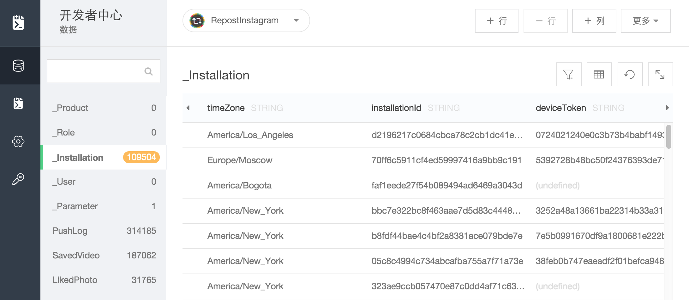

# Cloud Data
## Introduction

### What is Cloud Data
Cloud Data is the data storage service provided by Leap Cloud. It is based on the `LASObject` and each `LASObject` contains several key-values. All `LASObject` are stored in Leap Cloud, you can perform operations towards them with iOS/Android Core SDK. Besides, Leap Cloud  provides some special objects, like `LASUser`, `LASRole`, `LASFile` and `LASGeoPoint`. They are all based on `LASObject`.

### Why is Cloud Data Nccessary
Cloud Data can help you build and maintain the facility of your database, thus focus on the app service logic that brings real value.  The advantages can be summarized as follows:

* Sort out the deployment and maintenance of hardware resourses.
* Provide standard and complete data access API
* Unlike the traditional relational database, there's no class to be created ahead of time before storing data in cloud. Data objects in JSON format can be stored and retrieved easily as you wish.
* Realize the Hook of cloud data with the Cloud Code service.可结合Cloud Code服务，实现云端数据的Hook （Please check [Cloud Code Guide](LAS_DOCS_GUIDE_LINK_PLACEHOLDER_JAVA) for more details.） 

**If you want to learn more about LAS Cloud Data Service SDK, please check [iOS Guide － Cloud Data](LAS_DOCS_GUIDE_LINK_PLACEHOLDER_IOS#CloudData) or [Android Guide － Cloud Data](LAS_DOCS_GUIDE_LINK_PLACEHOLDER_Android#CloudData) for more details.**

##Class List
In Data of Dev Center, you can check the class list of your app:

If the type of a field is LASRelation, then it is related to other LASObject. The value of this column will show as "View Relations". You can check all LASObject related to this attribute by clicking it.

###Create/Edit Class
Click "+ Add Class" button, enter the Class name and then you've created the new class:

After the creation of new Class, you can select the Class and do modifications as shown below:

* Add new column: add attribute of Class
* Add new row: add new data
* Filter the data: click the hourglass icon 
* Choose column: click the Table button on the top right corner
* 
###Delete Class 
Select the Class you want to delete in the Class table, choose More>>Del Class and then click Apply.

## Next

**If you want to learn more about LAS Cloud Data Service SDK, please check [iOS Guide － Cloud Data](LAS_DOCS_GUIDE_LINK_PLACEHOLDER_IOS#CloudData) or [Android Guide － Cloud Data](LAS_DOCS_GUIDE_LINK_PLACEHOLDER_Android#CloudData) for more details.**
