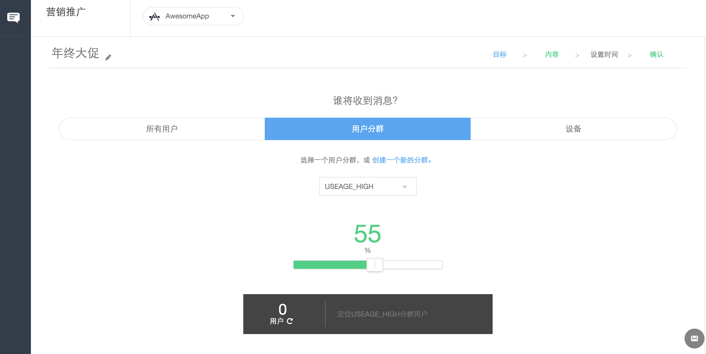
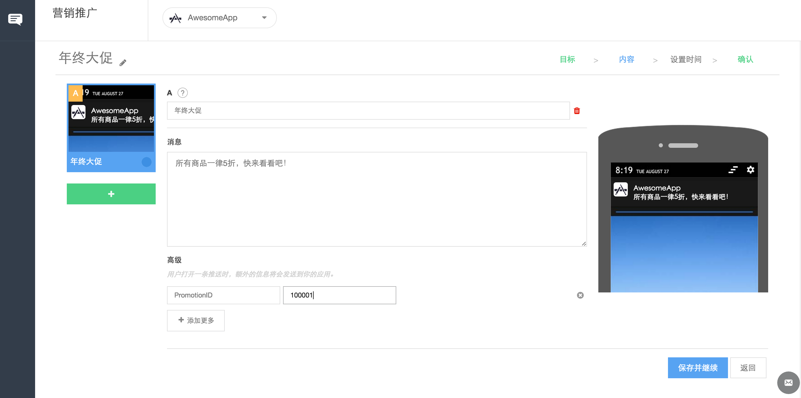
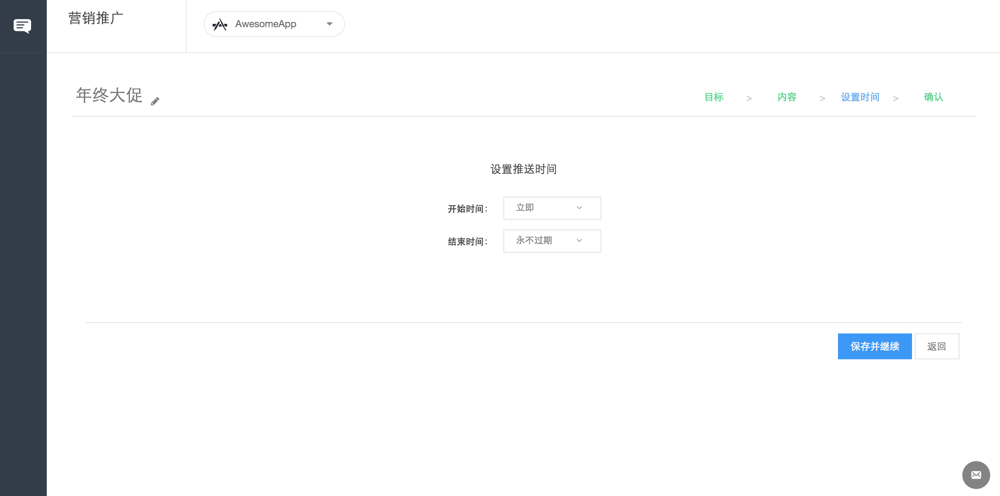
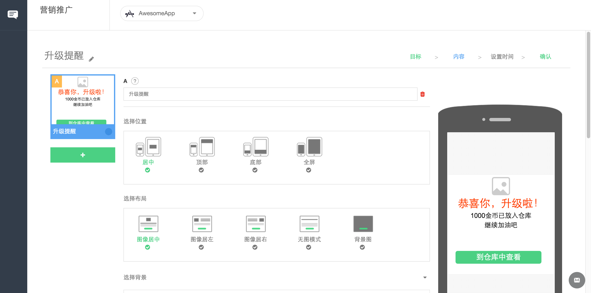

# Marketing
##Introduction
###What is LAS Marketing

Marketing is a promotion and message issuance service provided by Leap Cloud. There are two marketing types for you to choose: Push Notification and In-app Message. You can send Push Notifications to a certain group of people and show specific messages to a segment with In-app Message. You can even set the jump on user's click. The creation, settings and sending are all done in Console.

###Why is LAS Marketing Necessary 
With data from Analytics and Segment provided by LAS Users, you can make and implement marketing strategies with high efficiency. The advantages of LAS Marketing can be summarized as follows: 

* **Improve Penetrance: **Issue marketing campaign at any time to improve the user engagement and penetrance
* **Ensure the user experience: **More targeted to send messages to certain Segment 
* **Dynamic Content Management: **The content of Push Notifications and In-app Messages can be modified and updated in real time in Console. 

**If you want to learn more about LAS Marketing Service SDK, please check [iOS Guide － Marketing](LAS_DOCS_GUIDE_LINK_PLACEHOLDER_IOS#Marketing) or [Android Guide － Marketing](LAS_DOCS_GUIDE_LINK_PLACEHOLDER_ANDROID#Marketing) for more details.**
##Marketing Campaign List营销活动列表
In Marketing Campaign list, you can check all campaign（including**In-app Messages**and**Push Notifications**）details of an app:

##Create New Push Notification
Click "New Campaign + " >> Push, and then you can enter the create new Push page:

####Step 1: Choose push type
The target users can be divided into 3 types:

* All users
* Users from certain Segments （Please check [用户分群使用手册](LAS_DOCS__LINK_PLACEHOLDER_USERMANUAL/usermgmt.html) for more information about creating new **Segment** ）
* Users using certain devices

####Step 2: Create push content
A push contains contents as shown below, you need to fill and are able to preview while creating it.

* Push title 
* Push content 
* The parameter send to clients （Please check [Marketing － iOS Guide](LAS_DOCS_GUIDE_LINK_PLACEHOLDER_IOS) or [Marketing － Android Guide](LAS_DOCS_GUIDE_LINK_PLACEHOLDER_ANDROID) for more details.） 

Notice:

* You can create multiple messages in a campaign by clicking the "+" button on the left.
* 
####Step 3: Schedule Campaign

Finally, you need to set the sending time and expire time.

##Create New In-app Message
In-app message refers to the message send to users when they trigger certain actions. In-app messages can include text, images and a button whose jump can be defined by you.

Click "New Campaign + " >> In-app Message, and then you can enter the create new message page:

####Step 1: Choose push type
It's similar to step 1 of creating new push.

####Step 2: Create message content
An in-app message contains contents as shown below, you need to fill and are able to previw while creating it.

* Campaign name: the name of this in-app message
* Title
* Select position: Center, Top, Bottom or Full Page Interstitial
* Select Layout: the layout of text and image
* Select Background: choose background color&image(Support image upload)
* Design&Edit Content: the content, color, font and font-size
* Set Call to Action: the target Activity that will be jumped to after clicking Call to Action（Please check [Marketing － iOS Guide](LAS_DOCS_GUIDE_LINK_PLACEHOLDER_IOS) or [Marketing － Android Guide](LAS_DOCS_GUIDE_LINK_PLACEHOLDER_ANDROID) for more details）

Notice:

* You can create multiple messages in a campaign by clicking the "+" button on the left.
* 
####步骤三：Schedule Campaign and Set Expire Date

##Activate the Push/In-app message

The default status of a new campaign is Draft. You can select a push and click "Active" to change the status to Active. Then, the campaign will run normally.

## Next

**If you want to learn more about LAS Marketing Service SDK, please check [iOS Guide － Marketing](LAS_DOCS_GUIDE_LINK_PLACEHOLDER_IOS#Marketing) or [Android Guide － Marketing](LAS_DOCS_GUIDE_LINK_PLACEHOLDER_ANDROID#Marketing) for more details.**
