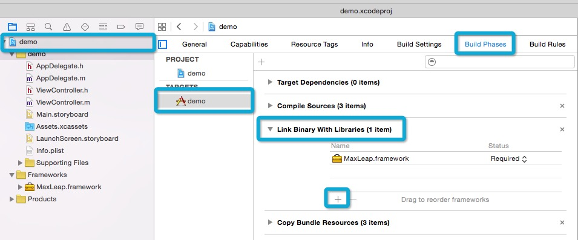

# Install the SDK

1. Download & unzip the SDK

	Make sure you are using the latest version of Xcode (5.0+) and targeting iOS 6.0 or higher.

	<a class="download-sdk" href="https://raw.githubusercontent.com/LeapAppServices/Leap Cloud-SDK-Release/master/iOS/v1.5.0/Leap CloudAll-v1.5.0.zip">Download SDK</a>

2. Add the SDK to your app

	Drag the `Leap Cloud.framework` you downloaded into your Xcode project folder target. Make sure the "Copy items to destination's group folder" checkbox is checked.
	
	<p class="image-wrapper">
	

3. Add the dependencies

	Click on Targets → Your app name → and then the 'Build Phases' tab.</br>
	Expand 'Link Binary With Libraries' as shown.
	
	<p class="image-wrapper">
	
	
    Make sure "Enable Modules (C and Objective-C)" and "Link Frameworks Automatically" build settings are YES.
    
    <p class="image-wrapper">
    
    
	Click the + button in the bottom left of the 'Link Binary With Libraries' section and add the following libraries:
	
	MobileCoreServices.framework</br>
	CoreTelephony.framework</br>
	SystemConfiguration.framework</br>
	libsqlite3.dylib</br>
	libz.dylib</br>

# Connect Your App to Leap Cloud Server

Open up your `AppDelegate.m` file and add the following import to the top of the file:

```objc
#import <Leap Cloud/Leap Cloud.h>
```
Then copy following code into `application:didFinishLaunchingWithOptions:` method:

```objc
[Leap Cloud setApplicationId:@"your_application_id" clientKey:@"your_client_id"];
```

Replace `your_application_id` and `your_client_id ` with the one of your Leap Cloud app.


Compile and run!


# Test the Connection to Leap Cloud App
We can add following code in `application:didFinishLaunchingWithOptions:` in `appDelegate.m` to test if we can connect Leap Cloud Services with the app:


```objc
#import <Leap Cloud/Leap Cloud.h>

- (BOOL)application:(UIApplication *)application didFinishLaunchingWithOptions:(NSDictionary *)launchOptions
{
[Leap Cloud setApplicationId:@"your_application_id" clientKey:@"your_client_key"];

// Create a piece of data
LCObject *testObject = [LCObject objectWithClassName:@"Person"];
testObject[@"Name"] = @"David Wang";
[LCDataManager saveObjectInBackground:testObject block:nil];
```

This code is used to create a piece of `Person` data. If there is no `Person` class in cloud, then it will create the class first and then insert data. 

Run you app and you can see the data just created in Dev Center -> Data.


