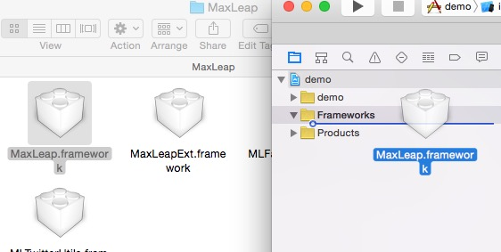

## Install the SDK

1. Download & unzip the SDK

	Make sure you are using the latest version of Xcode (5.0+) and targeting iOS 6.0 or higher.
	
	<a class="download-sdk" href="https://github.com/MaxLeap/Demo-Support-iOS" target="_blank">Download SDK</a>


2. Add the SDK to your app

	Drag the `MaxLeap.framework` you downloaded into your Xcode project folder target. Make sure the "Copy items to destination's group folder" checkbox is checked.
	
	<p class="image-wrapper">
	

	Drag `MLHelpCenter.embeddedframework` into Xcode project with the same method.

3. Add the dependencies

	Click on Targets → Your app name → and then the 'Build Phases' tab.</br>
	Expand 'Link Binary With Libraries' as shown.
	
	<p class="image-wrapper">
	
	
    Make sure "Enable Modules (C and Objective-C)" and "Link Frameworks Automatically" build settings are YES.
    
    <p class="image-wrapper">
    
    
	Click the + button in the bottom left of the 'Link Binary With Libraries' section and add the following libraries:
	
	StoreKit.framework</br>
	MobileCoreServices.framework</br>
	CoreTelephony.framework</br>
	SystemConfiguration.framework</br>
	libsqlite3.dylib</br>
	libz.dylib</br>

## Connect MaxLeap App

Open up your `AppDelegate.m` file and add the following import to the top of the file:

```objc
#import <MaxLeap/MaxLeap.h>
```

Then copy following code into `application:didFinishLaunchingWithOptions:` method:

```objc
[MaxLeap setApplicationId:@"your_application_id" clientKey:@"your_client_id"];
```

Replace `your_application_id` and `your_client_id ` with the one of your MaxLeap app.

Then enable HelpCenter module:

```
#import <MLHelpCenter/MLHelpCenter.h>

- (BOOL)application:(UIApplication *)application didFinishLaunchingWithOptions:(NSDictionary *)launchOptions
{
	[MaxLeap setApplicationId:@"your_application_id" clientKey:@"your_client_key"];
	[MLHelpCenter install];
}
```

Compile and run!

## Quick Test

1. Test the Connection to MaxLeap App

	We can add following code in `application:didFinishLaunchingWithOptions:` in `appDelegate.m` to test if we can connect MaxLeap Services with the app:


```objc
#import <MaxLeap/MaxLeap.h>

- (BOOL)application:(UIApplication *)application didFinishLaunchingWithOptions:(NSDictionary *)launchOptions
{
	[MaxLeap setApplicationId:@"your_application_id" clientKey:@"your_client_key"];

	// Create a piece of data
	MLObject *testObject = [MLObject objectWithClassName:@"Person"];
	testObject[@"foo"] = @"bar";
	[MLDataManager saveObjectInBackground:testObject block:nil];
}
```

This code is used to create a piece of `Person` data. If there is no `Person` class in cloud, then it will create the class first and then insert data.

Run you app and you can see the data just created in Dev Center -> Data.


2. Test if HelpCenter Module works well: 
	
Add following code in `viewDidAppear:` in `ViewController.m`:

```
[[MLHelpCenter sharedInstance] showFAQs:self];
```

Run the template project just configured, and you can see the following interface:


The FAQ of a new app contains General, Billing and Privacy. If this interface shows these 3 sections, then the connection is working properly.

Click the top right "Feedback" button in FAQ page:


Then fill the short description and title and click top right "Send" button. You may receive a auto response and it indicates that HelpCenter module is intergrated successfuly.


You can see this feedback in Support -> App Issues -> New Issues in MaxLeap website.
