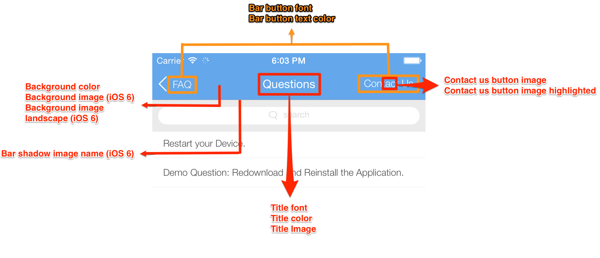
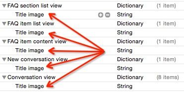
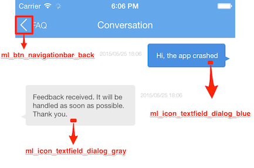
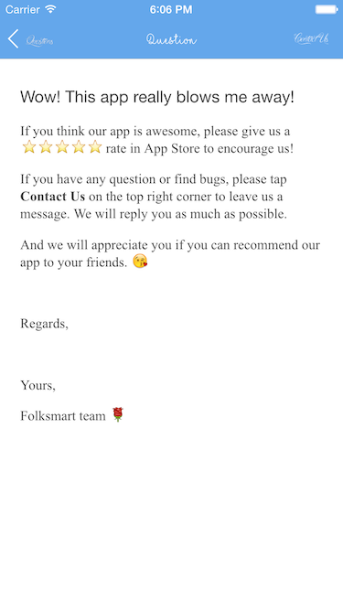

# Support

## Introduction

Support is a comprehensive customer service project provided by MaxLeap for developers.This project provides complete FAQ page and feedback chat window in clients. Support service also provides FAQ list management and feedback handling interface in Console.


## Preparations

1. Install and config MaxLeap Core SDK. Please check [QuickStart - Core SDK](ML_DOCS_LINK_PLACEHOLDER_SDK_QUICKSTART_IOS) for more details.
2. Install and config HelpCenter SDK. Please check [QuickStart - HelpCenter](ML_DOCS_LINK_PLACEHOLDER_SDK_QUICKSTART_IOS) for more details.

## Show FAQ Page

1. Show FAQ page by invoking following method
	
	```
	[[MLHelpCenter sharedInstance] showFAQs:self]; // self is the ViewController for popping up App Issues
	```

2. Call up feedback page

	You can click the Contact Us button on the top right FAQ page to enter feedback page or invoke following code toenter directly if necessary.

	```
	[[MLHelpCenter sharedInstance] showConversation:self]; // self is the viewcontroller for popping up App Issues
	```

## UI Settings

### Introduction

You can change the font, color and background pic of SDK UI by editing .plist file.

### Start Customization

There are three bundles in MLHelpCenter.emmbeddedframework: 

**MLHelpCenterThemes.bundle**        | fonts, colors, images and etc.
:-----------------------------|:----------------------------------
**MLHelpCenterImages.bundle**        | images
**MLHelpCenterLocalizable.bundle**  | strings in SDK page for localization

The UI settings of SDK is done by editing MLHelpCenterThemes.bundle/HelpCenterTheme.plist.<br>
Please make sure that you've added MLHelpCenterThemes.bundle and there is a file named HelpCenterTheme.plist.<br>

**Colors** | colors are designated by hexadecimal system. e.g. FF0000 refers to red.
:--------|:----------
**Images** | images are stored in MLHelpCenterImages.bundle, you can specify them with file names.<br>
MLHelpCenter supports iOS image naming convention(e.g. You can use @2x image on retina screen, if there's one.)。
**Fonts** | You can check [iosfonts.com](http://iosfonts.com/) to find available fonts on iOS of different versions.

[using custom fonts]: #using_custom_fonts

<aside class="notice">
    <span class="icon"></span>
    <span class="text">
        **Notice: font size and font name should be set at the same time.**<br>
        Fonts size depends on the font name, or it may turns out strange.
    </span>
</aside>

### Navigation Bar

These attributes will be applied to Navigation Bars of all interfaces.

**Title font name** 					| Font of title in NavigationBar Title
:--------------------------------------|:----------------------------------
**Title font size** 					| Font size of title in Navigation bar. It is a unitless number, like 18.
**Title color**     					| Color of title in Navigation bar
**Background color**					| Background color of Navigation bar
**Bar button font name**				| Font of button in Navigation bar
**Bar button font size**				| Font size of button in Navigation bar. It is a unitless number.
**Bar button text color**				| Text color of button in Navigation bar.
**Contact us button image**				| Icon of Contact Us button. The button only shows "Contact Us" by default.
**Contact us button image highlighted**| Icon of Contact Us button at highlight

There are more attributes that only compatible with iOS 6:

**Title shadow color (iOS 6)**			| Shadow color of title in Navigation bar, only compatible with iOS 6.
:--------------------------------------|:--------------------------------
**Title shadow offset (iOS 6)**			| Shadow offset of title in Navigation bar, only compatible with iOS 6.
**Background image (iOS 6)**			| Background image in Navigation bar, only compatible with iOS 6.
**Background image landscape (iOS 6)** | Background image in Navigation bar in landscape mode, only compatible with iOS 6.
**Bar shadow image name (iOS 6)**		| Shadow image of Navigation bar, only compatible with iOS 6.



#### Title Images

Except for aforementioned global attributes in navigation bar, you can set different title image for each page to replace the text title. Title image works on following 5 interfaces: 

1. **FAQ section list view**:      list page of FAQ section
2. **FAQ item list view**:         list page of FAQ item, namely, the page opened in section
3. **FAQ item content view**:      content page of a FAQ
4. **New conversation view**:      new conversation page
5. **Conversation view**:          conversation page

There are **Title image** fields under relative items in .plist file. You can replace the text title with image by designating an image name.



### User Feedback Page

You can set the background image of message box, the font and color of message for Chat page in here.

**Title image**             | Title image of Chat page
:---------------------------|:-------------------
**Message text font name**  | font of message
**Message text font size**  | font size of message
**Message text color left** | color of left message
**Message text color right**| color of right message
**Date text font name**     | font of date
**Date text font size**     | font size of date
**Date text color**         | color of date


### Customize Image Bundle

**Image bundle name**: The path of the custom image package relative to 'main bundle'. E.g. MLHelpCenterImages.bundle。

Part of the nomograms:




### <span id="using_custom_fonts">Use customized Font</span>

1. Add font file to the project. You need to add a "Fonts provided by application" key in info.plist file and then list the fonts you want to use in this key.
    

2. Copy full name of the font. Font name can be got in the profile of font file. Select the font file, press <kbd>COMMAND ⌘</kbd> + <kbd>I</kbd> (to check profile) and then you can open the font profile panel.
    

3. Paste the font name in relative filed in MLHelpCenterThemes.bundle/HelpCenterTheme.plist。
    

4. Test fonts in simulator. The wrong fonts will be ignored by SDK.
    
