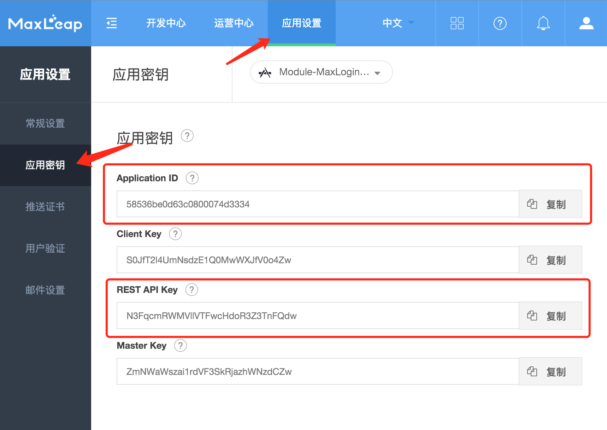

# SDK 集成

## 全新项目

###	使用模板创建 MaxLeap 项目

1.	获取项目模板，并解压缩至您的 Workspace

    <a class="download-sdk" href="https://github.com/MaxLeap/StarterProject-Android/archive/master.zip" target="_blank">下载 Android 项目模板</a>

2.	打开项目模板

    **Android Studio**

    1. 	打开 Android Studio，点击 “Import project”
    2. 	进入项目模板根目录，选择 `setting.gradle`
    3. 	按照默认配置点击下一步，直到完成

###	配置 MaxLeap 项目

1. 连接项目与 MaxLeap 应用

	在 `Application` 的 `onCreate()` 方法中，调用 `MaxLeap.initialize` 来设置您应用的 `Application ID` 和 `REST API Key`：

```java
import android.app.Application;
import com.maxleap.MaxLeap;

public class MyApplication extends Application {
    @Override
    public void onCreate() {
        super.onCreate();
        MaxLeap.initialize(this, "appid", "restapikey", MaxLeap.REGION_CN);
    }
}
```

2. 权限配置

	在 `AndroidManifest.xml` 中，给予应用以下权限：

```xml
<uses-permission android:name="android.permission.READ_PHONE_STATE" />
<uses-permission android:name="android.permission.ACCESS_WIFI_STATE" />
<uses-permission android:name="android.permission.ACCESS_NETWORK_STATE" />
<uses-permission android:name="android.permission.INTERNET" />
```

    权限|用途|是否必需
    ---|---|---
    `ACCESS_NETWORK_STATE`|		检测联网方式，区分用户设备使用的是2G、3G或是WiFi| 必需
    `INTERNET`| 	允许应用程序联网，以便向我们的服务器端发送数据| 必需
    `READ_PHONE_STATE`| 	获取用户设备的IMEI，通过IMEI来唯一的标识用户| 可选
    `ACCESS_WIFI_STATE`| 	获取用户设备的MAC地址，通过MAC地址来唯一的标识用户| 可选

3. 配置用户渠道

	在 `AndroidManifest.xml` 中配置用户渠道，渠道名可以是 `google_play` 之类的任意字符串。

```xml
<application>
   <meta-data
        android:name="ml_channel"
        android:value="google_play"/>
</application>
```

4. 快速测试项目配置

    为了测试项目是否已经注册至 MaxLeap，我们可以向 `Application` 的 `onCreate()` 方法中添加以下代码：

```java
import android.app.Application;
import com.maxleap.MaxLeap;
import com.maxleap.MLQueryManager;
import com.maxleap.MLQuery
import com.maxleap.MLObject;

public class MyApplication extends Application {
    @Override
    public void onCreate() {
        super.onCreate();
        MaxLeap.initialize(this, "appid", "restapikey", MaxLeap.REGION_CN);

        //测试当前sdk的appid和restapikey配置是否正确。正式环境可移除。
        MaxLeap.checkSDKConnection();
    }
}
```

    
    运行应用，查看 Logcat 的输出日志，没有错误的话，您已经完成 MaxLeap SDK 的安装与必要的配置。


## 已有项目

1. 安装 SDK
	[下载 SDK](https://s3.cn-north-1.amazonaws.com.cn/docs.maxleap.cn/Android/latest/maxleap-sdk-all-latest.zip)

2. 将 SDK 添加至项目

    将解压后的所有 `maxleap-*.jar` 文件，拖拽至项目的 `libs` 目录中。如果你们的项目没有 `libs` 目录，那么就在项目的根目录下创建一个：通过右键点击项目 `Project`，选择 `New`，接下来点击 `Directory` 菜单即可创建新目录。

    **Android Studio**

    在 `build.gradle` 文件中添加下述依赖：

```gradle
dependencies {
    compile fileTree(dir: 'libs', include: ['*.jar'])
}
```
    
    同步Gradle后,即可添加完成。

###	配置 MaxLeap 项目

1. 连接项目与 MaxLeap 应用

	在 `Application` 的 `onCreate()` 方法中，调用 `MaxLeap.initialize` 来设置您应用的 `Application ID` 和 `REST API Key`：

```java
import android.app.Application;
import com.maxleap.MaxLeap;

public class MyApplication extends Application {
    @Override
    public void onCreate() {
        super.onCreate();
        MaxLeap.initialize(this, "appid", "restapikey", MaxLeap.REGION_CN);
    }
}
```

2. 权限配置

 	在 `AndroidManifest.xml `中，给予应用以下权限：

```xml
<uses-permission android:name="android.permission.READ_PHONE_STATE" />
<uses-permission android:name="android.permission.ACCESS_WIFI_STATE" />
<uses-permission android:name="android.permission.ACCESS_NETWORK_STATE" />
<uses-permission android:name="android.permission.INTERNET" />
```

    权限|用途|是否必需
    ---|---|---
    `ACCESS_NETWORK_STATE`|		检测联网方式，区分用户设备使用的是2G、3G或是WiFi| 必需
    `INTERNET`| 	允许应用程序联网，以便向我们的服务器端发送数据| 必需
    `READ_PHONE_STATE`| 	获取用户设备的IMEI，通过IMEI来唯一的标识用户| 可选
    `ACCESS_WIFI_STATE`| 	获取用户设备的MAC地址，通过MAC地址来唯一的标识用户| 可选

3. 配置用户渠道

	在 `AndroidManifest.xml` 中配置用户渠道，渠道名可以是 `google_play` 之类的任意字符串。


```xml
<application>
   <meta-data
        android:name="ml_channel"
        android:value="google_play"/>
</application>
```


4. 快速测试项目配置

    为了测试项目是否已经注册至 MaxLeap，我们可以向 `Application` 的 `onCreate()` 方法中添加以下代码：

```java
import android.app.Application;
import com.maxleap.MaxLeap;
import com.maxleap.MLQueryManager;
import com.maxleap.MLQuery
import com.maxleap.MLObject;

public class MyApplication extends Application {
    @Override
    public void onCreate() {
        super.onCreate();
        MaxLeap.initialize(this, "appid", "restapikey", MaxLeap.REGION_CN);
        
       //测试当前sdk的appid和restapikey配置是否正确。正式环境可移除。
       MaxLeap.checkSDKConnection();
    }
}
```


    运行应用，查看 Logcat 的输出日志，没有错误的话，您已经完成 MaxLeap SDK 的安装与必要的配置。
    
## 更多集成配置
    
除了快速集成的方式来连接项目与maxleap应用，您也可以通过如下几种方式更灵活的配置:

- 在**AndroidManifest.xml**中配置相应的meta-data所对应的value

```xml
<application>
      <meta-data
           android:name="com.maxleap.APPLICATION_ID"
           android:value="appid" />
       <meta-data
           android:name="com.maxleap.REST_API_KEY"
           android:value="restapikey" />
       <meta-data
           android:name="ml_region"
           android:value="CN" />
</application>
```

在自定义的**Application**中调用：


```java
import android.app.Application;
import com.maxleap.MaxLeap;
import com.maxleap.MLQueryManager;
import com.maxleap.MLQuery
import com.maxleap.MLObject;

public class MyApplication extends Application {
    @Override
    public void onCreate() {
        super.onCreate();
        MaxLeap.initialize(this);

       //测试当前sdk的appid和restapikey配置是否正确。正式环境可移除。
       MaxLeap.checkSDKConnection();
    }
}
```
    
    
    注：代码中配置的优先级会高于**AndroidManifest.xml**中配置的优先级。如果您同时在xml和代码中配置，将以代码配置为准。
    
- 使用Options参数的方式初始化

```java
import android.app.Application;
import com.maxleap.MaxLeap;
import com.maxleap.MLQueryManager;
import com.maxleap.MLQuery
import com.maxleap.MLObject;

public class MyApplication extends Application {
    @Override
    public void onCreate() {
        super.onCreate();
        
        MaxLeap.Options options = new MaxLeap.Options();
        options.applicationID = "appid";
        options.restAPIKey = "restapikey";
        options.serverRegion = MaxLeap.REGION_CN;        
        
        MaxLeap.initialize(this, options);
        
       //测试当前sdk的appid和restapikey配置是否正确。正式环境可移除。
       MaxLeap.checkSDKConnection();
    }
}
```

使用Options参数的方式初始化，灵活度更高。您可根据实际的项目需求进行配置。 
    
## FAQ

Q: 提示"应用访问凭证不正确，请检查"是什么原因?

  A:我们提供了用于检测SDK是否正确的配置的方法:**MaxLeap.checkSDKConnection()**。该api会向后端查询一个名为`testTable`的表格,而此表格默认并未被创建。如果您的配置正确,后端会正确的返回该表格的状态,以此状态来判断配置是否正确。如果配置错误,则无法正常的获取该表的状态。
  
  可以到如下页面查看应用的配置信息
  
  	<p class="image-wrapper">
  	

  需要正确的配置对应的Application ID和REST API key初始化之后,才能正常的访问。


Q: 提示"SDK 成功连接到你的云端应用"为什么日志中还会打印http 400异常?

  A:该提示表示您的sdk配置正确,只需移除MaxLeap.checkSDKConnection()测试连接的代码即可。

Q: 已经正确配置sdk,但是还是无法正常使用?

A:可以从以下几点进行排除:

* 检查您的应用是否配置了相关的权限。
* 检查网络连接是否通畅。
* 检查自定义的Application是否在AndroidManifest.xml中的`<application>`节点的name进行了修改。
* 下载最新版本的sdk。
* 您可以尝试参考我们的开源组件[https://github.com/MaxLeap/Module-MaxLogin-Android](https://github.com/MaxLeap/Module-MaxLogin-Android)