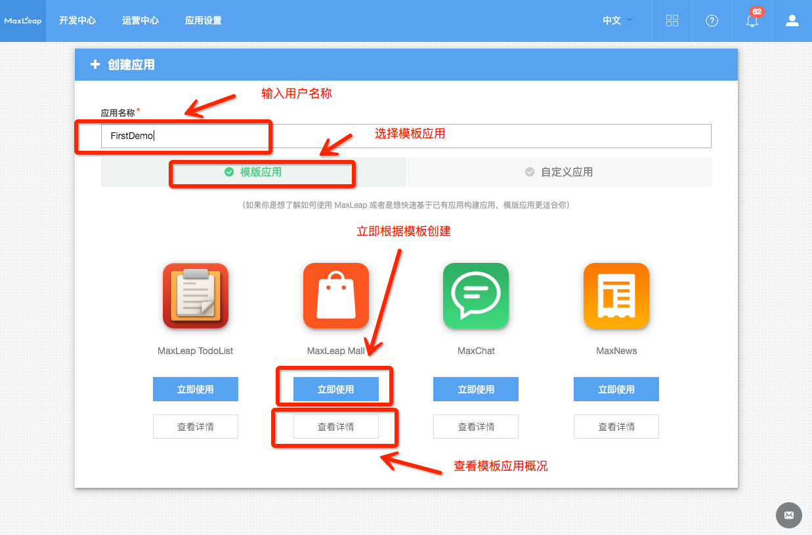
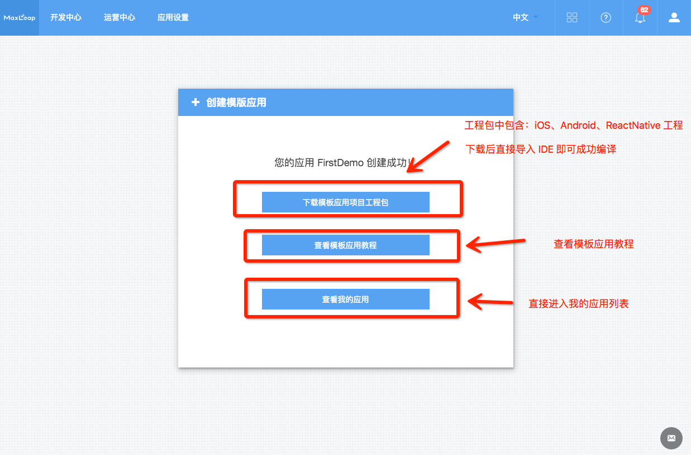
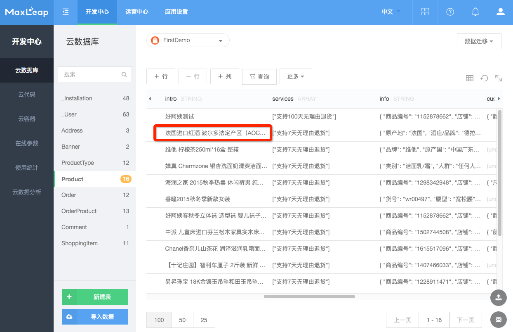
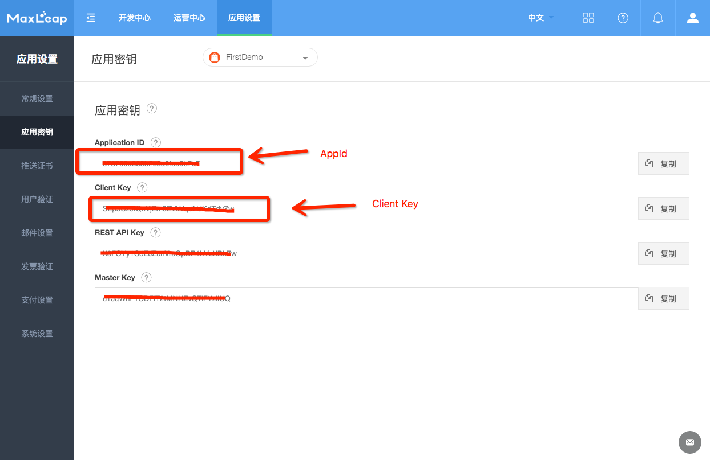

# JavaScript 快速入门

## 创建应用
MaxLeap 提供两种模式创建应用
### 自定义应用
用户自行创建工程项目并配置，根据具体业务设计数据库表结构和对应逻辑。

1、点击创建应用后，进入如下页面，输入应用名称并选择自定义应用，然后点击创建按钮

2、点击创建按钮后，应用创建成功，如果下图所示，可以应用相关密钥信息、移动端新手指南入口和我的应用列表入口

新手指南如下：[iOS 新手指南 ](https://maxleap.cn/s/web/zh_cn/quickstart/ios/core/new.html) ，[Android 新手指南 ](https://maxleap.cn/s/web/zh_cn/quickstart/android/core/new.html) ，[React Native 新手指南 ](https://maxleap.cn/s/web/zh_cn/quickstart/android/core/new.html) 


### 模板应用
直接基于 MaxLeap 提供的模板应用快速开发，模板应用包括配置好的移动端工程项目、后端工程项目（视具体模板应用而定，不一定都有）以及云端初始化数据，您可以基于模板应用开发您的应用。


1、点击创建应用，并输入用户名，下面选择模板应用

2、模板应用可以查看详情或者立即根据此模板创建，点击查看详情进入如下UI

3、点击立即使用后，MaxLeap 会自动生成配置好的移动端工程项目、后端工程项（视具体模板应用而定，不一定都有）和后端初始化云数据

4、生成好以后，您可以下载项目工程，里面包括：iOS、Android、ReactNative 等移动端工程，如果有后端工程项目（视具体模板应用而定），也会包含

5、可以直接进入我的应用列表页面查看刚创建好的应用

6、点击开发选择进入开发中心云数据库查看云端初始化数据

7、工程项目下载完成后解压出工程项目（以 iOS 为例）并导入Xcode，直接运行即可查看模板应用，AppId 和 ClientKey 已经自动配置完成

8、可以在应用设置下的应用密钥中查看应用的相关key，包括 AppId 和 ClientKey 等


 Ok，是不是很简单呢，您可以直接基于我们的模板应用快速构建您自己的应用，Happy Coding!!!!
 
 1. 把下面这行代码加入您的测试页面中：

	```javascript
	<script src="https://rawgit.com/MaxLeap/SDK-Javascript/master/dist/ml.js"></script>
	```

2. 进入 [MaxLeap](https://maxleap.cn) 注册并登录，然后在 [云数据](https://maxleap.cn/p/console/clouddata) 创建表，这里创建一个Post 表。
	
	注意：Javascript SDK没有创建 / 删除表的权限，所以要先在 [云数据](https://maxleap.cn/p/console/clouddata) 中创建好需要用到的表。
	   

3. 进入 [应用设置－应用密钥](https://maxleap.cn/p/console/settings#application) 复制 Application ID，Client Key。
 
4. 初始化SDK调用，Javascript SDK 分别为 [中国区](https://maxleap.cn) / [海外区](https://maxleap.com) 用户提供了不同的服务器（默认为美国区服务器）： ML.useCNServer() / ML.useENServer()

	```javascript
	ML.initialize('{{appid}}', '{{restapikey}}');
	ML.useCNServer();
	```

## 开始测试

1. 注册应用内用户并登录：

	```javascript
	var user = new ML.User();
	user.set('username', 'yourname@example.com');
	user.set('password', 'yourpassword');
	user.set('email', 'yourname@example.com');
	
	user.signUp().then(function (user) {
		alert('success');
	});
	```
	注意：
	[云数据](https://maxleap.cn/p/console/clouddata) 中的数据操作需要权限认证，所以请确保您在登录状态。

2.  存储数据：

	```javascript
	var Post = ML.Object.extend('Post');
	post.set('title', 'post title');
	post.save().then(function(){
		alert('success');
	});
	```


至此，您已经完成 Javascript SDK 的安装与必要的配置。
##下一步
至此，您已经完成 Javascript SDK 的安装与必要的配置。请移步至 [Javascript SDK开发指南](https://maxleap.cn/s/web/zh_cn/guide/devguide/javascript.html) 以获取 MaxLeap 的详细功能介绍以及使用方法，开启 MaxLeap 云服务之旅。