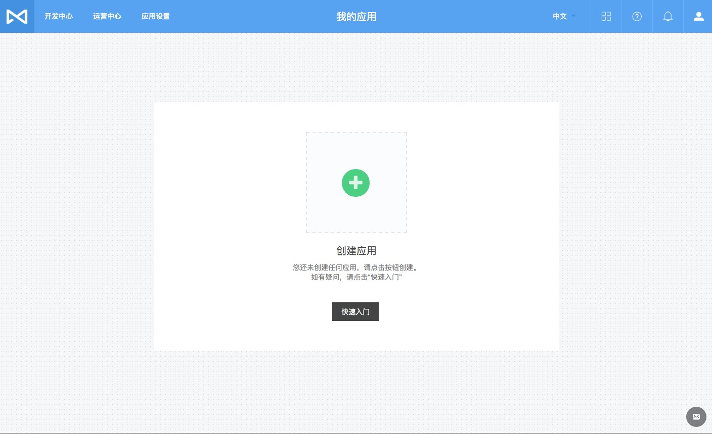

# PHP 快速入门
## 注册并登录 MaxLeap
首次登录会进入如下未创建过 App 页面



## 创建应用
### 自定义应用
用户自行创建工程项目并配置，根据具体业务设计数据库表结构和对应逻辑。

1、点击创建应用后，进入如下页面，输入应用名称并选择自定义应用，然后点击创建按钮

2、点击创建按钮后，应用创建成功，如果下图所示，可以应用相关密钥信息、移动端新手指南入口和我的应用列表入口

新手指南如下：iOS 新手指南 ](quickstart/iosquickstart.html) ，[Android 新手指南 ](quickstart/androidquickstart.html) ，[React Native 新手指南 ](quickstart/reactnativequickstart.html)  


目前 MaxLeap PHP SDK 仅支持 **移动支付** 服务，更多服务敬请期待。

## 兼容性

目前 MaxLeap 的php-SDK 运行于 php 5.4 以上版本,您也可以对库文件进行适当修改，以符合您所使用的php环境。就目前所知的兼容性问题包括但不仅限于函数数组的使用,譬如 $ret_array()[]。

### 如何查看php版本

```
php -version
```

## 安装SDK

php pay sdk仅包含一个库文件，您可以直接去github上下载该文件即可。

### 获取SDK

[下载](https://github.com/MaxLeap/SDK-MaxPay-PHP/archive/master.zip)

有效文件为 MLPay.php


## 测试SDK
### bill 测试
通过内部文件testMLpay.php，可以对MLPay.php库文件进行简单的测试

#### 支付宝支付

```
php testMLpay.php bill ali_web
```
此时，我们将得到如下结果：

```
stdClass Object
(
    [id] => 56930318e4b0018057291132
    [ali_app] => _input_charset="utf-8"&notify_url="http://101.95.153.34:7777/maxpay/alinotify"&out_trade_no="56930318e4b0018057291132"&partner="2088121305224121"&payment_type="1"&return_url="http://www.qq.com"&seller_id="2088121305224121"&service="mobile.securitypay.pay"&sign="mlwsJRkiiEdkGKjteE3gVNQP8ZT8BlxvE2yK7AAsHXAu1N33MZcTMKxXxnTcMBdMsSa%2FIta6c21LTjtOFVouCttHEzrJxmi60CRsJGtj4Wx1eqqAozjDfR%2BWA%2B5MC0CHIAv%2FTGLN%2BWJxcQrivFsTDqh%2Fapwv6uO8jlJPLOLxkOU%3D"&sign_type="RSA"&subject="it will be ok!"&total_fee="0.01"
    [ali_web] => https://mapi.alipay.com/gateway.do?_input_charset=utf-8&notify_url=http://101.95.153.34:7777/maxpay/alinotify&out_trade_no=56930318e4b0018057291132&partner=2088121305224121&payment_type=1&return_url=http://www.qq.com&seller_id=2088121305224121&service=create_direct_pay_by_user&sign=0791e8812c3c16729ba45bd009e2f257&sign_type=MD5&subject=it will be ok!&total_fee=0.01
    [msg] => OK
    [code] => 0
)
```

表明支付宝支付接口测试通过。

注意:

* 返回的数据对象所包含的内容以用户提交的数据为准。

#### 微信支付

```
php testMLpay.php bill wx_native
```
此时，我们将得到如下结果：

```
stdClass Object
(
    [prepayid] => wx20160119104319f0f91df8b90436948052
    [codeUrl] => weixin://wxpay/bizpayurl?pr=IysMGTv
    [code] => 0
)
```
表明微信支付接口测试通过。

注意:

* 返回的数据对象所包含的内容以用户提交的数据为准。

#### 银联支付

```
php testMLpay.php bill unipay_web
```
此时，我们将得到如下结果：

```
stdClass Object
(
    [html] => <html>......</html>
    [code] => 0
)
```
表明银联支付接口测试通过。

注意:

* 返回的数据对象所包含的内容以用户提交的数据为准。

### Record 测试

```
php testMLpay.php record
```

此时，系统会给出所有关于billNum='112233'的所有付款内容

```
stdClass Object
(
    [results] => Array
        (
            [0] => stdClass Object
                (
                    [billNum] => 112233
                    [channel] => ali_web
                    [createdTime] => 1451963296736
                    [currency] => CNY
                    [endTime] => 1451963326237
                    [id] => 568b33a0f7e4beba9244a8e0
                    [money] => 0.01 CNY
                    [status] => success
                    [totalFee] => 1
                )

            [1] => stdClass Object
                (
                    [billNum] => 112233
                    [channel] => ali_web
                    [createdTime] => 1451963799276
                    [currency] => CNY
                    [id] => 568b3577f7e4826974829ef6
                    [money] => 0.01 CNY
                    [status] => created
                    [totalFee] => 1
                )
  ...
  }
```
表明查询接口测试通过。

至此表明该SDK部署全部成功。

### 注:

* 微信支付返回的codeUrl可以生成一个二维码进行扫码支付，代码参考如下

```
$widhtHeight = 200;
$EC_level='L';
$margin='0';
$chl=$codeUrl;
$size="xxxx";
echo '';
```

* 银联支付返回的html可以生成一个html页面，该页面会带领用户前往银联认证页面进行相关支付行为。

##下一步
至此，您已经完成 MaxLeap PHP-PAY-SDK 的安装与必要的配置。请移步至[php-pay-sdk 开发教程](https://maxleap.cn/s/web/zh_cn/guide/devguide/php.html)以获取 PHP-PAY-SDK 的详细功能介绍以及使用方法。