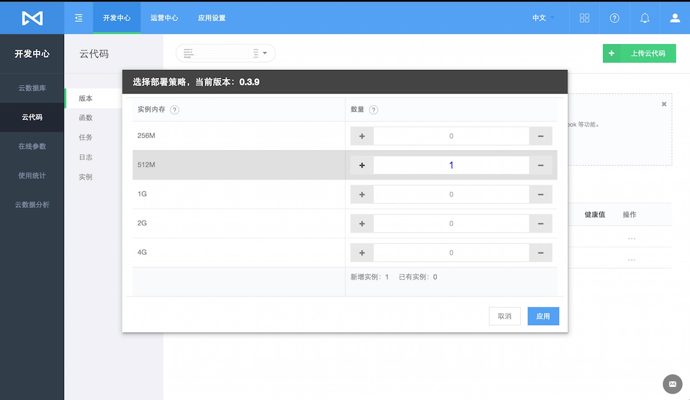
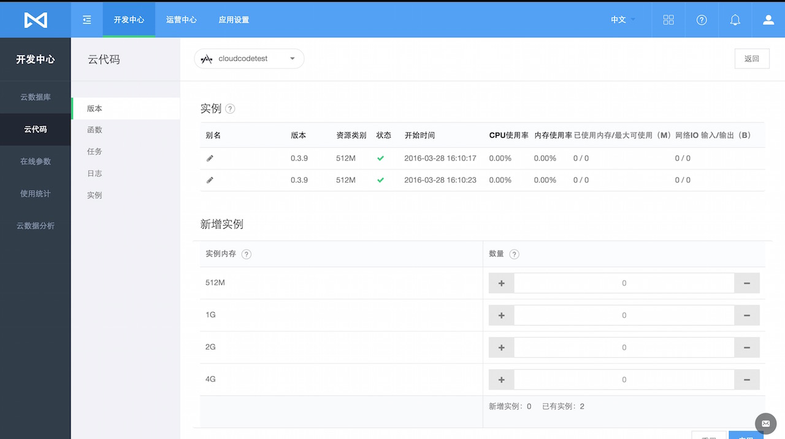
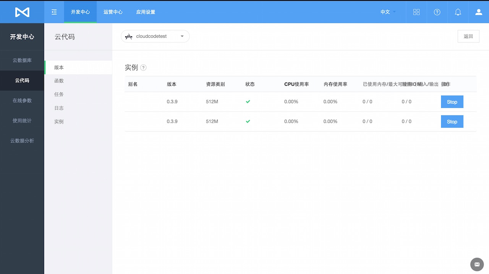
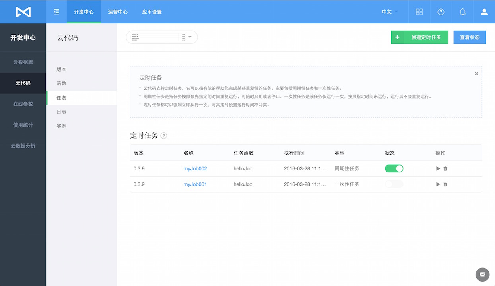
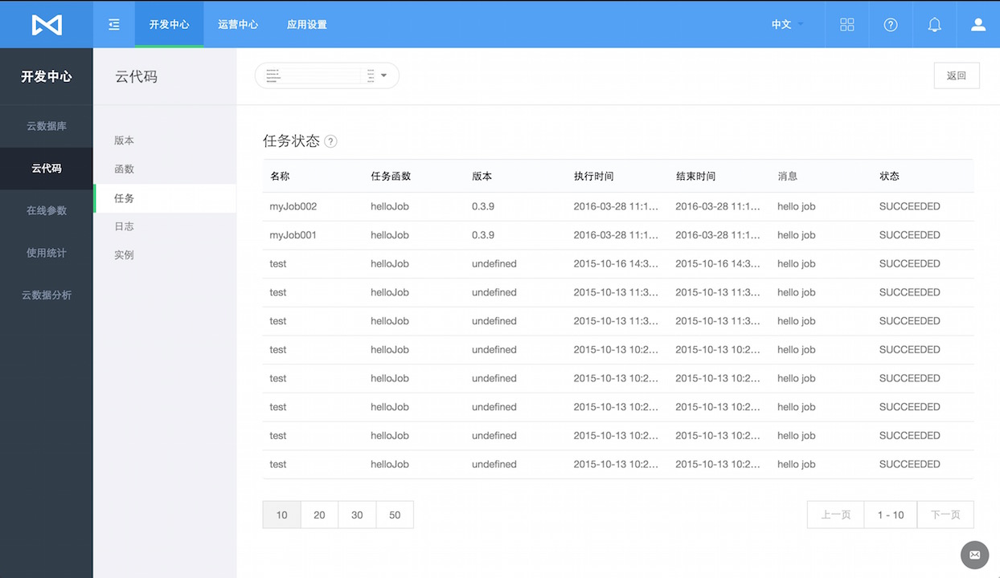
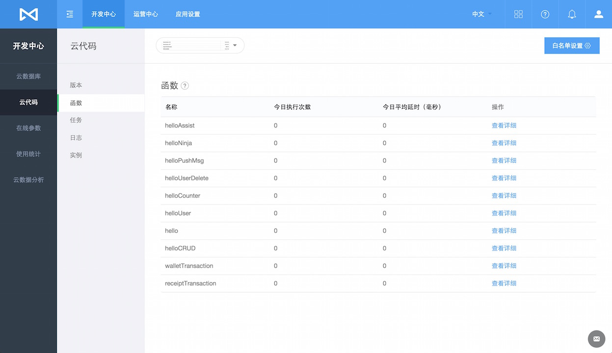

# 云代码
## 简介
### 什么是云代码服务
云代码是部署运行在 MaxLeap 云引擎上的代码，您可以用它来实现较复杂的，需要运行在云端的业务逻辑。它类似于传统的运行在 Web server上的 Web Service或 RESTful API。它对外提供的接口也是 RESTful API，也正是以这种方式被移动应用调用。

目前支持 Java、Python、Node.js，其他语言尽请期待。

### 为什么需要云代码服务

如果应用非常简单，我们可以将业务逻辑都放在客户端里面实现。然而，当应用需要实现比较复杂的业务逻辑，访问更多的数据或需要大量的运算时，我们便需要借助云代码服务实现。其优势在于：

* 强大的运算能力：云代码运行在 MaxLeap 的 Docker 容器中，可以使用多个CPU和大容量内存进行计算
* 更高效：可以在一次调用中通过高速网络多次请求 Cloud Data，大大提升效率
* 同一套代码可以为iOS，Android，Web Site等提供服务

在应用管理页面中，您可以查看，新建和管理各个版本的云代码及相应的日志。

##版本状态
在"版本状态"报表中，我们可以查看上传至该应用下的所有的云代码。该报表包含以下列：

* 版本号：每份上传的云代码，都有一个唯一的版本号标识，定义在云代码项目中的global.json中
* 状态：对应版本号的云代码是否被部署并处于正常运行状态
* 实例数量：对应版本号的云代码部署了几个实例
* 配置：查看云代码的配置文件global.json. 包括 应用名，应用信息(App ID/MasterKey)，Cloud Code项目信息(编写语言/入口函数名/Hook包名/Entity包名)及版本号等信息。
* 上传时间：对应版本最新的上传时间，同一个版本重复上传取最近的上传时间
* 开始时间：对应版本第一个实例启动的时间，即对应版本开始提供服务的时间
* 健康值：对应版本的健康值百分比，系统会对每个版本实例定期做健康检查
* 操作：每个版本都有相应的操作，包括部署、扩容、缩容、流量控制、停用、删除等操作

###上传云代码
在"版本状态"报表中，我们可以上传该应用下的云代码。点击上传云代码按钮选择本地ZIP文件即可上传云代码

###部署
在每个版本操作中，我们选择部署操作，你需要选择想要的部署策略（选择资源类型和对应启动的实例数量）来完成部署

###扩容
在每个版本操作中，如果你已经部署了该版本，你可以再次扩容该版本，以达到支撑更好规模的业务，上限最多同时运行3个实例

###缩容
在每个版本操作中，如果你已经部署了该版本并且该版本下的实例数量不少于1个，可以减少实例的数量，以便不必要的资源消耗

###停用
如果你已经部署了一个版本，你可以停止该版本的服务，如此该版本启动的所有实例都会被删除

###删除
你可以删除一个没有部署任何实例的版本

###灰度发布
MaxLeap允许我们最多部署2个版本，以便我们在发布新版本的时候可以平滑过渡，即灰度发布。如果我们已经部署了一个版本，再部署另一个版本时会执行灰度发布操作，首先你需要设置2个版本的请求流量比例

如果你2个版本中有一个版本的比例为0，那么该版本将会无法对外提供服务，设置好流控后便可以选择部署策略来完成灰度发布了

###控流
只有当灰度发布期间才有控流操作，它允许你在灰度发布期间的所有请求按照指定比例负载到不同的版本上

##任务
任务是指将云代码中某个任务指定在某个时间运行。

####查看任务列表
通过任务报表，我们可以查看当前已经被安排的任务，点击每个任务，可以修改任务信息。
任务按照种类可以分为周期性任务和一次性临时任务，周期性任务可以禁用，一次性临时任务无法禁用。定时任务都可以强制立即执行一次，与其定时设置运行时间不冲突

####新建任务
您可以通过“创建定时任务”，运行云代码中的任务。创建时，您需要提供

* 名称：任务名
* 当前版本：该任务执行在对应版本上，无法选择，系统会默认指定为应用当前的最新版本
* 函数名：云代码中定义的任务名
* 安排时间：设置任务的开始运行时间
* 安排重复：设置任务的重复运行模式
* 参数：传递至云代码任务的JSON参数

####查看任务执行状态
任务状态中，您可以查看任务，每次执行任务后的状态和结果。包括执行时间，结束时间以及是否成功。

##日志
您可以通过日志，查看以下信息：

* Cloud Function的上传部署信息
* Hook Entities的Cache信息
* 云代码API请求信息
* 在云代码中通过日志API记录的其他日志

你可以查看对应版本下的日志，指定版本下的日志为显示所有实例的日志

日志被分为三种类型：Info（信息），Error（错误）及Warn（警告）。

##函数
在函数中，您可以查看所有云代码中的任务的执行概况：

* 今日执行次数
* 今日平均延时：执行时间与计划之间的延时
* 操作：该函数历史调用次数，成功次数及失败次数

##实例
为了确保云代码健康运行，MaxLeap 将会自动为每个版本的云代码分别启动一个或多个实例。您可以查看每个实例的运行状况，包括：

* 别名：可编辑，以便用户可以识别具体的实例
* 版本：当前运行实例所属的版本
* 资源类型：当前运行实例所使用的资源类别
* 状态：当前运行实例的状态，健康为绿色勾，不健康为红色叉，不健康状态下可以点击图标查看具体的错误信息
* 开始时间：当前运行实例的启动时间
* CPU/内存使用率
* 内存使用及上限
* 网络IO输入及输出

###多实例
每个版本你都可以部署多个实例，这些实例可以通过扩容、缩容来增减以符合你的业务需求，同一个版本最多支持同时允许3个实例，同一个版本里的请求流量将均衡负载到每一个实例上以便减轻系统的业务压力

##白名单
可以将函数的某个调用方法添加至白名单，添加后，当请求调用该函数时，将不进行Http请求头中X-ML-AppId和X-ML-APIKey的校验。

## FAQ
内容更新中

## SDK 开发指南

### 移动端 SDK

[iOS 开发指南](ML_DOCS_GUIDE_LINK_PLACEHOLDER_IOS#CLOUD_CODE_ZH)

[Android 开发指南](ML_DOCS_GUIDE_LINK_PLACEHOLDER_ANDROID#CLOUD_CODE_ZH)

### 服务端 SDK

[Java 开发指南](ML_DOCS_GUIDE_LINK_PLACEHOLDER_JAVA)

[Python 开发指南](ML_DOCS_GUIDE_LINK_PLACEHOLDER_PYTHON)

[Node.js 开发指南](ML_DOCS_GUIDE_LINK_PLACEHOLDER_NODEJS)
