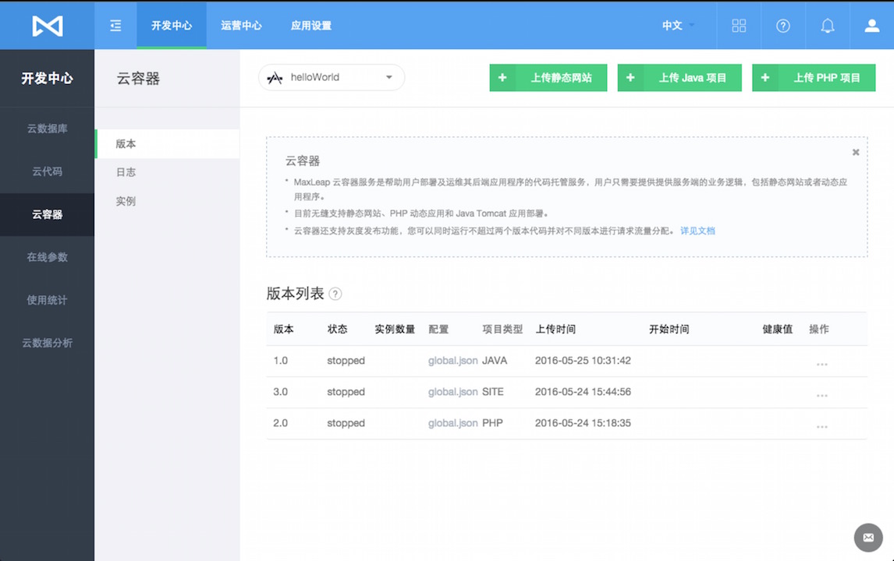
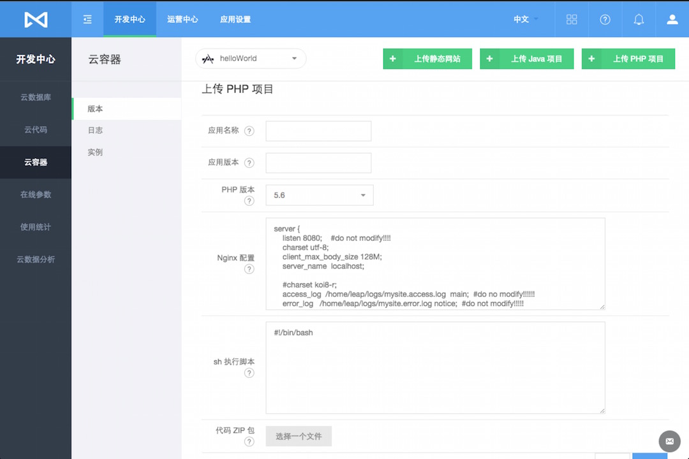

# 云容器
## 简介
### 什么是云容器服务
MaxLeap 云容器服务是帮助用户 **部署及运维** 其后端应用程序的代码托管服务，用户只需提供服务端的业务逻辑，包括静态网站或者动态应用程序，而服务端的高可用、多实例、负载均衡、不中断服务的平滑升级等都由云容器提供支持。

**静态网页** 目前支持

* 纯 HTML 静态网页组成的网站

	其他语言及应用尽请期待。
 
**动态应用程序** 目前支持 
 
* Java Tomcat 应用程序
* PHP
 
	其他语言及应用尽请期待。

### 为什么需要 MaxLeap 云容器服务

* **降低运维时间及成本**，用户不需考虑高可用、性能、负载均衡及不中断服务的平滑升级等
*  **灵活**，MaxLeap 不需用户修改其应用程序配置，支持直接将已有应用项目部署（仅需修改数据源，如果有数据访问逻辑）
*  **开放**，应用程序可以完全自由迁出至用户自有环境，MaxLeap 对用户来说仅仅是个新的部署环境
*  **高效稳定**，云容器基于 Docker 技术，实时，动态水平扩展，灵活应对各种流量激增，瞬间访问压力

在管理页面中，您可以查看，新建和管理各个版本的云代码及相应的日志。

## 使用流程


## 核心概念

### 服务器程序版本
在"版本"模块中，我们可以查看上传至该应用下的所有的服务器程序。该模块包含以下列：

* 版本号：每份上传到云容器的服务器程序，都有一个唯一的版本号标识，需要你在上传服务器程序的时候指定
* 状态：对应版本号的服务器程序是否被部署并处于正常运行状态
* 实例数量：对应版本号的服务器程序部署了几个实例
* 配置：查看服务器程序的配置. 包括名称，服务器程序项目信息及版本号等信息。
* 项目类型：对应版本所属的服务器程序类型,包括 JAVA/PHP/SITE 多种类型
* 上传时间：对应版本最新的上传时间，同一个版本重复上传取最近的上传时间
* 开始时间：对应版本第一个实例启动的时间，即对应版本开始提供服务的时间
* 健康值：对应版本的健康值百分比，系统会对每个版本实例定期做健康检查
* 操作：每个版本都有相应的操作，包括部署、扩容、缩容、流量控制、停用、删除等操作

如下图所示：



####上传服务器程序
在"版本"模块中，我们可以上传该应用下的服务器程序。根据部署程序类型，选择点击 **上传静态网站** / **上传JAVA项目** / **上传PHP项目** 来上传并配置，详情如下：

#####静态网站

#####Java Tomcat 项目

#####PHP 项目


####部署
在每个版本操作中，我们选择部署操作，你需要选择想要的部署策略（选择资源类型和对应启动的实例数量）来完成部署


####扩容
在每个版本操作中，如果你已经部署了该版本，你可以再次扩容该版本，以达到支撑更好规模的业务，上限最多同时运行3个实例


####缩容
在每个版本操作中，如果你已经部署了该版本并且该版本下的实例数量不少于1个，可以减少实例的数量，以便不必要的资源消耗


####停用
如果你已经部署了一个版本，你可以停止该版本的服务，如此该版本启动的所有实例都会被删除

####删除
你可以删除一个没有部署任何实例的版本

####灰度发布
MaxLeap 允许最多部署两个版本，以便我们在发布新版本的时候可以平滑过渡，即灰度发布。

如果我们已经部署了一个版本，再部署另一个版本时会执行灰度发布操作，首先你需要设置两个版本的请求流量比例


如果你的两个版本中有一个版本的比例为0，那么该版本将会无法对外提供服务，设置好流控后便可以选择部署策略来完成灰度发布了

####控流
只有当灰度发布期间才有控流操作，它允许你在灰度发布期间的所有请求按照指定比例负载到不同的版本上

 
### 日志
您可以通过日志，查看以下信息：

* Java 项目的 Web 容器日志
* PHP 项目和静态网站的 Nginx 日志

你可以查看对应版本下的日志，指定版本下的日志为显示所有实例的日志

日志被分为三种类型：Info（信息），Error（错误）及Warn（警告）。


### 实例

您可以查看每个实例的运行状况，包括：

* 别名：可编辑，以便用户可以识别具体的实例运行的对应服务程序
* 版本：当前运行实例所属的应用服务程序的版本
* 资源类型：当前运行实例所使用的资源类别
* 状态：当前运行实例的状态，健康为绿色勾，不健康为红色叉，不健康状态下可以点击图标查看具体的错误信息
* 开始时间：当前运行实例的启动时间
* CPU/内存使用率
* 内存使用及上限
* 网络IO输入及输出


####多实例
每个版本你都可以部署多个实例，这些实例可以通过扩容、缩容来增减以符合你的业务需求，同一个版本最多支持同时允许3个实例，同一个版本里的请求流量将均衡负载到每一个实例上以便减轻系统的业务压力

## 应用准备及注意

### 静态网站
静态网站是指不包含 php,perl,python,java 等动态服务器脚本的只含有html 文件，png 图片的网站。

1. 准备一个目录，**目录名称必须为html**，把所有的网站文件拷贝到目录 html 下面。
2. 用 zip 工具打包, zip -r html.zip html ，**包名必须是 html.zip**。
3. 准备自己的 nginx config 文件，调整相应设置。你也可以不修改提供的 nginx conf 文件，本模板是一个可以直接使用的，使用默认目录的 nginx 配置。注意如果要修改 nginx conf 文件，则模板里面系统注释部分不要更改，否则容器不能启动。

### PHP 应用
目前 PHP 支持 5.6 版本

1. 准备一个目录，**目录名称必须为 html**，把所有的网站文件拷贝到目录 html 下面。
2. 在 MaxLeap 平台上创建应用，进入【应用设置 -> 系统设置】，创建 Mysql 数据库，拿到数据源连接字符串，用户名和密码。
3. 修改 php 项目的数据源连接，用户名和密码，并且数据库名也是和用户名相同。
4. 用 zip 工具打包, zip -r html.zip html ，**包名必须是 html.zip**。
5. 准备自己的 nginx config 文件，调整相应设置，包括 url 伪装，转发，静态文件 location 等设置。你也可以不修改提供的 nginx conf 文件，本模板是一个可以直接使用的，使用默认目录的 nginx 配置。注意模板里面系统注释部分不要更改，否则容器不能启动。
6. （可选）准备容器启动后需要运行的 sh 脚本，以 yii framework 为例， 需要修改 web/assets 权限，web 发布目录根据 nginx 配置，默认是 /var/www/html/

```
chmod 777 /var/www/html/web/assets
chmod 777 /var/www/html/runtime
```

并更改目录的属主属性，属主和目录的名称如果用户没有更改ngxin config文件，那么命令格式如下：
```
chown -R www-data:www-data /var/www/html
```

* 注: 容器内的工作端口是8080,但提供给用户的端口是80，所以用户请不要使用系统变量$_SERVER['SERVER_PORT'], 从而避免让页面转到URL:8080/XXX，这是不正确的访问方式。已知在Discuz上存在此问题。

### Java 应用

目前支持运行在 Tomcat 容器的应用，主要包括如下具体版本：

1. Tomcat 6 (支持 Servlet 版本 2.5)
2. Tomcat 7 (支持 Servlet 版本 3.0)
3. Tomcat 8 (支持 Servlet 版本 3.1)
4. Tomcat 9 (支持 Servlet 版本 4.0)

你需要将你的应用代码打包成 war 包方可上传到 MaxLeap 云容器部署。

Jetty 等其他容器内测中，敬亲期待。。。


## FAQ
内容更新中

## Demo 项目
### Java Tomcat
[Demo-CloudContainer-Tomcat](https://github.com/MaxLeap/Demo-CloudContainer-Tomcat)

### PHP
[Demo-CloudContainer-PHP](https://github.com/MaxLeap/Demo-CloudContainer-PHP)

### 静态网站
[Demo-CloudContainer-WebSite](https://github.com/MaxLeap/Demo-CloudContainer-WebSite)
