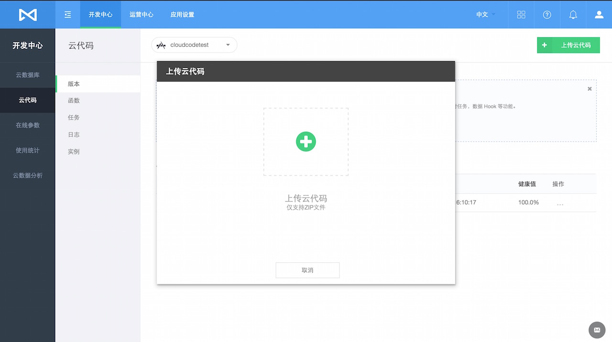
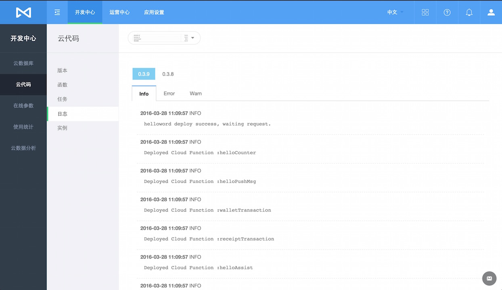

# 云容器
## 简介
### 什么是云容器服务
MaxLeap 云容器服务是帮助用户 **部署及运维** 其后端应用程序的代码托管服务，用户只需要提供提供服务端的业务逻辑，包括静态网站或者动态应用程序，而服务端的高可用、多实例、负载均衡、不中断服务的平滑升级等都由云容器提供支持。

**静态网页** 目前支持

* 纯 HTML 静态网页组成的网站

	其他语言及应用尽请期待。
 
**动态应用程序** 目前支持 
 
* Java Tomcat 应用程序
* PHP
 
	其他语言及应用尽请期待。

### 为什么需要 MaxLeap 云容器服务

* **降低运维时间及成本**，用户不需考虑高可用、性能、负载均衡及不中断服务的平滑升级等
*  **灵活**，MaxLeap 不需用户修改其应用程序配置，支持直接将已有应用项目部署（仅需修改数据源，如果有数据访问逻辑）
*  **开放**，应用程序可以完全自由迁出至用户自有环境，MaxLeap 对用户来说仅仅是个新的部署环境
*  **高效稳定**，云容器基于 Docker 技术，实时，动态水平扩展，灵活应对各种流量激增，瞬间访问压力

在管理页面中，您可以查看，新建和管理各个版本的云代码及相应的日志。

## 使用流程

## 核心概念

### 应用版本
在"版本"报表中，我们可以查看上传至该应用下的所有的云代码。该报表包含以下列：

* 版本号：每份上传的云代码，都有一个唯一的版本号标识，定义在云代码项目中的global.json中
* 状态：对应版本号的云代码是否被部署并处于正常运行状态
* 实例数量：对应版本号的云代码部署了几个实例
* 配置：查看云代码的配置文件 global.json. 包括 应用名，应用信息(App ID/MasterKey)，Cloud Code 项目信息(编写语言/入口函数名/Hook包名/Entity包名)及版本号等信息。
* 上传时间：对应版本最新的上传时间，同一个版本重复上传取最近的上传时间
* 开始时间：对应版本第一个实例启动的时间，即对应版本开始提供服务的时间
* 健康值：对应版本的健康值百分比，系统会对每个版本实例定期做健康检查
* 操作：每个版本都有相应的操作，包括部署、扩容、缩容、流量控制、停用、删除等操作

如下图所示：


####上传应用程序
在"版本"报表中，我们可以上传该应用下的云代码。点击上传云代码按钮选择本地ZIP文件即可上传云代码



####部署
在每个版本操作中，我们选择部署操作，你需要选择想要的部署策略（选择资源类型和对应启动的实例数量）来完成部署


####扩容
在每个版本操作中，如果你已经部署了该版本，你可以再次扩容该版本，以达到支撑更好规模的业务，上限最多同时运行3个实例


####缩容
在每个版本操作中，如果你已经部署了该版本并且该版本下的实例数量不少于1个，可以减少实例的数量，以便不必要的资源消耗


####停用
如果你已经部署了一个版本，你可以停止该版本的服务，如此该版本启动的所有实例都会被删除

####删除
你可以删除一个没有部署任何实例的版本

####灰度发布
MaxLeap允许我们最多部署2个版本，以便我们在发布新版本的时候可以平滑过渡，即灰度发布。

如果我们已经部署了一个版本，再部署另一个版本时会执行灰度发布操作，首先你需要设置2个版本的请求流量比例


如果你的两个版本中有一个版本的比例为0，那么该版本将会无法对外提供服务，设置好流控后便可以选择部署策略来完成灰度发布了

####控流
只有当灰度发布期间才有控流操作，它允许你在灰度发布期间的所有请求按照指定比例负载到不同的版本上

 
### 日志
您可以通过日志，查看以下信息：

* Cloud Function 的上传部署信息
* Hook Entities的 Cache 信息
* 云代码 API 请求信息
* 在云代码中通过日志 API 记录的其他日志

你可以查看对应版本下的日志，指定版本下的日志为显示所有实例的日志

日志被分为三种类型：Info（信息），Error（错误）及Warn（警告）。




### 实例
为了确保云代码健康运行，MaxLeap 将会自动为每个版本的云代码分别启动一个或多个实例。您可以查看每个实例的运行状况，包括：

* 别名：可编辑，以便用户可以识别具体的实例
* 版本：当前运行实例所属的版本
* 资源类型：当前运行实例所使用的资源类别
* 状态：当前运行实例的状态，健康为绿色勾，不健康为红色叉，不健康状态下可以点击图标查看具体的错误信息
* 开始时间：当前运行实例的启动时间
* CPU/内存使用率
* 内存使用及上限
* 网络IO输入及输出


####多实例
每个版本你都可以部署多个实例，这些实例可以通过扩容、缩容来增减以符合你的业务需求，同一个版本最多支持同时允许3个实例，同一个版本里的请求流量将均衡负载到每一个实例上以便减轻系统的业务压力

## 应用准备及注意

### 静态网站
静态网站的意思是不包含php,perl,python,java等动态服务器脚本的只含有html文件，png图片的网站

1. 准备一个目录，目录名称必须为html，把所有的网站文件拷贝到目录html下面。
2. 用zip工具打包, zip -r html.zip html ，包名必须是html.zip。
3. 准备自己的nginx config文件，调整相应设置。注意nginx conf 模板里面系统注释部分不要更改，一旦更改，轻则失去系统监测支持，重则容器不能启动。

### PHP 应用
目前PHP支持 6.5版本

1. 准备一个目录，目录名称必须为html，把所有的网站文件拷贝到目录html下面。
2. 用zip工具打包, zip -r html.zip html ，包名必须是html.zip。
3. 准备自己的nginx config文件，调整相应设置，包括url伪装，转发，静态文件location等设置注意nginx conf 模板里面系统注释部分不要更改，一旦更改，轻则失去系统监测支持，重则容器不能启动。
4. 准备 容器一旦启动的sh脚本，以yii framework 为例， 需要修改web/assets权限，web发布目录根据nginx 配置，默认是var/www/html/

```
chmod 777 /var/www/html/web/assets
```

### Java Tomcat 应用


## FAQ
内容更新中

## Demo 项目
### Java Tomcat
[Demo-CloudContainer-Tomcat](https://github.com/MaxLeap/Demo-CloudContainer-Tomcat)

### PHP
[Demo-CloudContainer-PHP](https://github.com/MaxLeap/Demo-CloudContainer-PHP)

### 静态网站
[Demo-CloudContainer-WebSite](https://github.com/MaxLeap/Demo-CloudContainer-WebSite)
