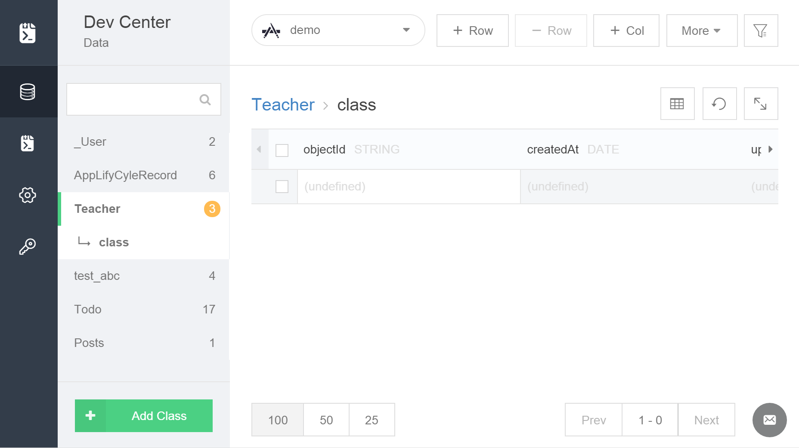
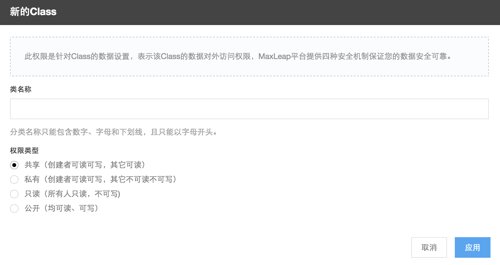

# Cloud Data
## 简介

### 什么是Cloud Data服务
Cloud Data是Leap Cloud提供的数据存储服务，它建立在对象`LASObject`的基础上，每个`LASObject`包含若干键值对。所有`LASObject`均存储在Leap Cloud上，您可以通过iOS/Android Core SDK对其进行操作，也可在Console中管理所有的对象。此外Leap Cloud还提供一些特殊的对象，如`LASUser`(用户)，`LASRole`(角色)，`LASFile`(文件)，`LASGeoPoint`(地理位置)，他们都是基于`LASObject`的对象。

### 为何需要Cloud Data服务
Cloud Data将帮助您解决数据库基础设施的构建和维护，从而专注于实现真正带来价值的应用业务逻辑。其优势在于：

* 解决硬件资源的部署和运维
* 提供标准而又完整的数据访问API
* 不同于传统关系型数据库，向云端存储数据无需提前建表，JSON 格式的对象随存随取，高并发访问轻松无压力
* 可结合Cloud Code服务，实现云端数据的Hook （详情请移步至[Cloud Code引导](。。。)） 

**如果您希望进一步了解LAS Cloud Data服务SDK，请参考[iOS开发指南 － Cloud Data]()或[Android开发指南 － Cloud Data](../../Android/Guide/CloudData.md)。**

##Class列表
在开发者中心的"数据"分类中，我们可以查看该应用下所有的Class的列表：

若某个字段的类型为LASRelation，即关联了其他LASObject，该列的值会显示为"View Relations".点击后，便可查看该属性关联的所有LASObject.

###新建/修改Class
点击"＋添加类"按钮，输入Class名，便可以完成Class的新建：

新建Class完毕后，您可以选中改Class后，对其进行如下修改：

* 新建列：添加Class属性
* 新建行：添加一条数据
* 筛选表格数据显示：点击沙漏图标
* 选择表格显示列：点击右上角表格图标

###删除Class
在Claas列表中选中要删除的Class，在右侧选择 更多 >> 删除类，确认即可。

## 下一步

**如果您希望进一步了解LAS Cloud Data服务SDK，请参考[iOS开发指南 － Cloud Data]()或[Android开发指南 － Cloud Data](../../Android/Guide/CloudData.md)。**
