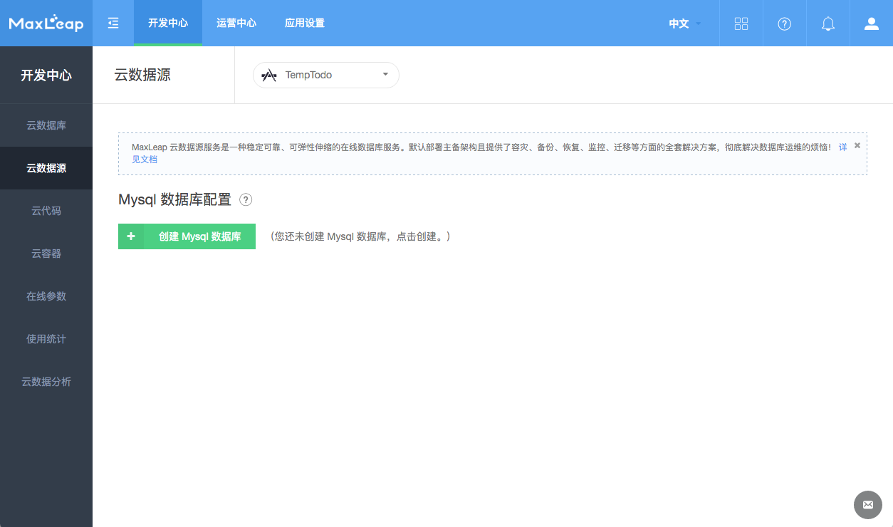
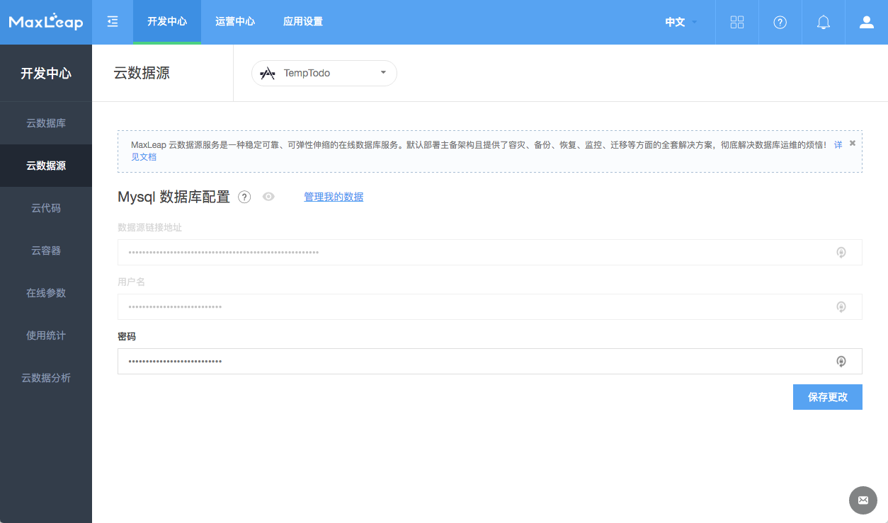
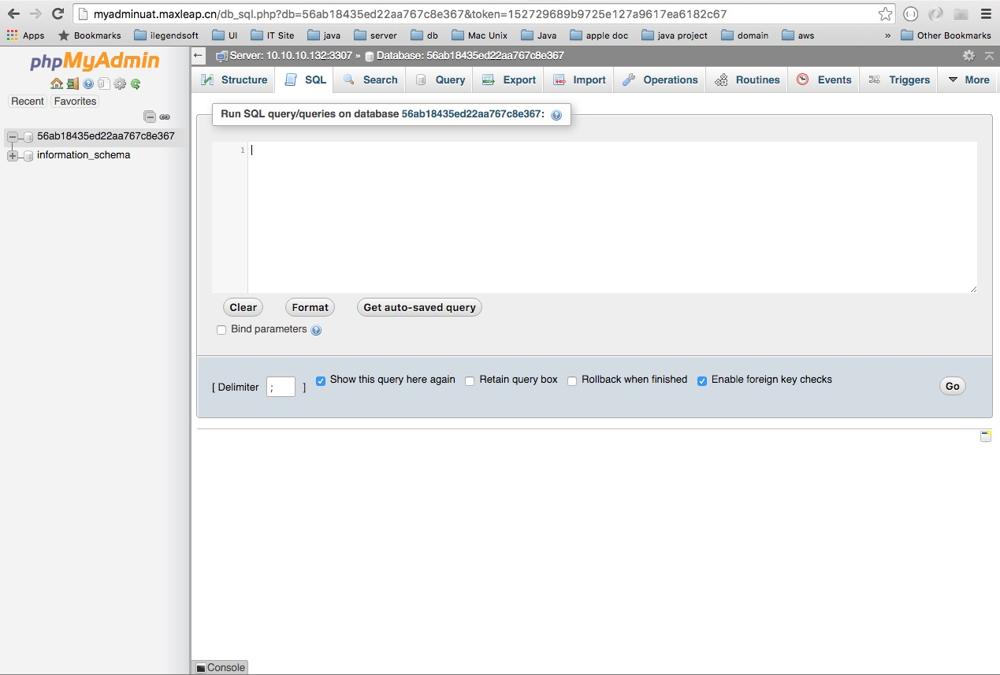

# 数据源

## 简介

### 什么是数据源服务
MaxLeap 数据源服务是一种稳定可靠、可弹性伸缩的在线数据库服务。基于 Docker 技术，支持 MySQL、Mongo等，默认部署主备架构且提供了容灾、备份、恢复、监控、迁移等方面的全套解决方案，彻底解决数据库运维的烦恼！

**数据源服务目前仅支持部署在 MaxLeap 平台上的云代码项目或者云容器项目。**

我们将尽快对外完全开放。

### 为何需要数据源服务

* **降低运维时间及成本**，用户不需考虑高可用、性能、灾备等运维成本
*  **易用**，完全无缝支持原生数据库，不用再次学习，直接上手
*  **开放**，数据支持完全自由迁出至用户自有环境，MaxLeap 对用户来说仅仅是个新的部署环境
*  **高效稳定**，基于 Docker 技术，实时，动态水平扩展，灵活应对各种流量激增，瞬间访问压力

## 支持数据库

### Mysql

MaxLeap 平台为每个应用准备一个以 appId 命名的数据库，用户可以在【应用设置 -> 系统设置】里启用，启用后会生成数据源连接地址、用户名和密码，密码可以任意修改。

#### 支持版本
目前支持 Mysql 5.0 及以上版本

#### 管理入口

在提供 phpMyAdmin 管理台管理数据库

### Mongo
内测中，敬请期待。。。

## 数据迁移

### Mysql
支持 Mysql dump 一键导出导入

### Mongo
内测中，敬请期待。。。

## 使用流程
### 注册并登录 MaxLeap 并创建一个应用
### 创建数据库

**目前仅支持 Mysql 5.0 及以上版本数据库**

Mongo 数据库内测中，敬请期待。。。

1、进入【开发中心 -> 云数据源】，如下图所示：

2、点击【创建 Mysql 数据源】成功后会生成对应的数据库连接地址、用户名（AppId）和密码，密码可以修改

3、点击眼睛按钮查看数据源链接地址、用户名和密码详情，至此当前应用的 Mysql 数据库已成功创建

### 管理数据

1、进入【开发中心 -> 云数据源】，在 Mysql 数据库配置右边，点击【管理我的数据】进入phpMyAdmin 管理台，就像在本地操作自己数据库一样开始你的操作

2、MaxLeap 会给当前应用创建一个以 AppId 命名的数据库，你可随意操作

## 使用场景
### MaxLeap 云代码
可以在 MaxLeap 云代码服务中无缝连接数据源服务，通过原生访问数据库方式进行数据访问
### MaxLeap 云容器
MaxLeap 云容器中的动态应用如果需要数据库支持，仅需把数据源对应的数据库连接地址、用户名、密码配置到应用程序中即可，就像在本地使用数据库

## 注意事项
1、目前 MaxLeap 数据源仅支持 运行在 MaxLeap 平台上的云代码项目以及云容器里面的项目

## FAQ
内容更新中

## Demo 项目
### Java Tomcat
[Demo-CloudContainer-Tomcat](https://github.com/MaxLeap/Demo-CloudContainer-Tomcat)

### PHP
[Demo-CloudContainer-PHP](https://github.com/MaxLeap/Demo-CloudContainer-PHP)

