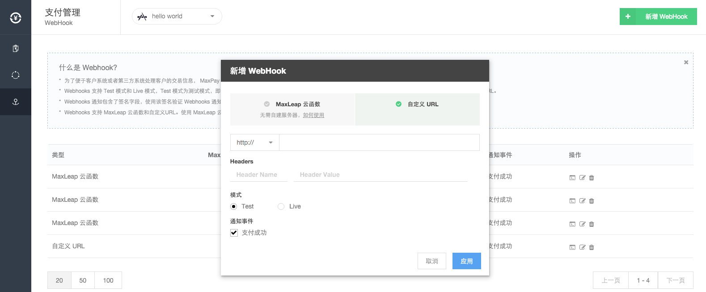

# MaxPay WebHook
   为了便于客户系统或者第三方系统处理客户的交易信息， MaxPay 提供 WebHook 功能，可以按照客户要求把特定的事件结果推送到指定的地址以便于客户做后续处理。

## WebHook 类型

### MaxLeap 云函数

    您可以使用 MaxLeap 云代码中的云函数来实现您的WebHook功能，MaxLeap 云函数会处理来自 MaxPay 的通知事件。使用 MaxLeap 云函数意味着您将不用自建服务器，详情请参考 [MaxLeap － 云代码](ML_DOCS_LINK_PLACEHOLDER_USERMANUAL#CLOUD_CODE_ZH)。
    
### 自定义URL

  您也可以自建服务器来接收来自 MaxPay 的通知事件。
    
## 如何使用 WebHook

### 第一步：配置你的 WebHook

####新增 WebHook
登录 MaxLeap 支付管理平台，点击你创建的应用,点击左侧 WebHook 选项。新建一个 WebHook 事件的基本操作如下图所示，用户需要设置接收 WebHook 事件的地址、模式和事件类型。
其中，WebHook 的服务器可以选择 MaxLeap 提供的云函数，也可以是自己服务器的 URL。
使用MaxLeap 云函数：

自定义 URL:

* WebHook 的云函数

	当支付事件发生时，MaxLeap 会向用户注册的 WebHook 推送消息，用户可以直接使用 MaxLeap 提供的云函数来处理这些消息，这样就不需要自己建立服务器了。
	
* WebHook 的URL

	MaxLeap 可以向用户自己的服务器推送消息，你也可以根据自己的需要添加特殊的 Http Headers。

* WebHook 的模式

    WebHook 支持 Test 模式和 Live 模式，即事件中包含的数据内容可以源于测试环境也可以源于生产环境。
    
* WebHook 支持的事件

	目前 WebHook 仅支持支付成功事件。

####编辑 WebHook
在 WebHook 列表中，点击“编辑”图标可以编辑该条 WebHook。

####切换 WebHook 模式
WebHook 支持 Test 模式和 Live 模式，Test 模式为测试模式，即可以在MaxPay 控制台发送测试数据测试接收URL是否正常；Live 模式为生产环境，即正常交易记录会通知至该URL。
在 WebHook 列表中， 点击对应的模式按钮即可切换模式：

####删除 WebHook
如果一个 WebHook 不再使用，可以点击 WebHook 列表中的“删除”图标来删除它。

### 第二步：接收 WebHook 通知
当一个支付事件发生后，将POST一个HTTP请求到webhook，数据是以json的形式放到body里。你需要接受该请求并处理数据：返回http状态码200表示成功；返回的状态码不是200或者超时未返回，maxleap将尝试发送多达10次的webhook通知直到返回200的状态码，间隔为1分钟,5分钟,10分钟,30分钟,1小时,2小时,4小时,8小时,16小时,24小时，若超过该次数，便不再尝试。
### 第三步：验证 WebHook 签名（可选）
MaxPay 的 WebHook 通知中包含的签名信息，签名放在了请求的json里sign中，除此之外还有一个timestamp字段。

1. 用户需用自己的 MaxLeap 的Appid，MasterKey和timestamp依次连接成一个字符串。
2. 后用Md5算法对该字符串加密得到16进制表示的字符串。
3. 得到的字符串与sign进行比较，若内容相同，则验证通过，否则失败。

用户再自行确认金额等订单信息是否正确。

## 如何测试 WebHook
###测试 WebHook
完成 WebHook 的配置后，你可以使用 WebHook 的测试功能对你填写的地址进行测试。你可以在已配置的 WebHook 中选择事件类型发起测试，你将看到 MaxLeap 向你填写的 URL 发送的请求内容以及你的服务器向 MaxLeap 服务器返回的内容，MaxLeap 将根据你返回的 HTTP 状态码判断你的服务器是否接收成功。
在 Webhook 列表中，点击“测试”图标可以测试该条 WebHook 是否配置成功。

MaxLeap 云函数类型的 WebHook 测试：

自定义 URL 的 WebHook 测试：

