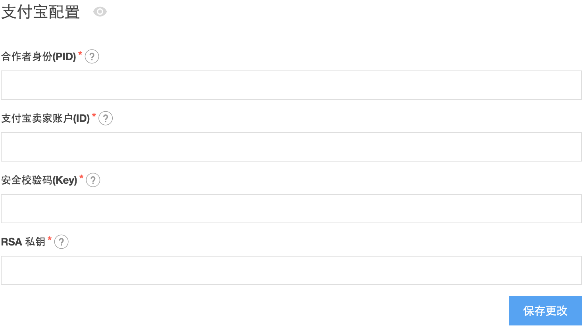
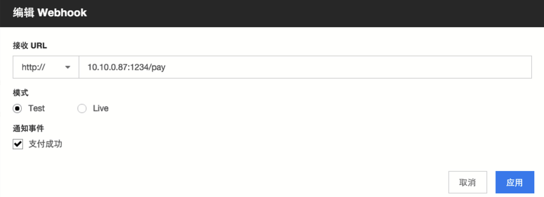
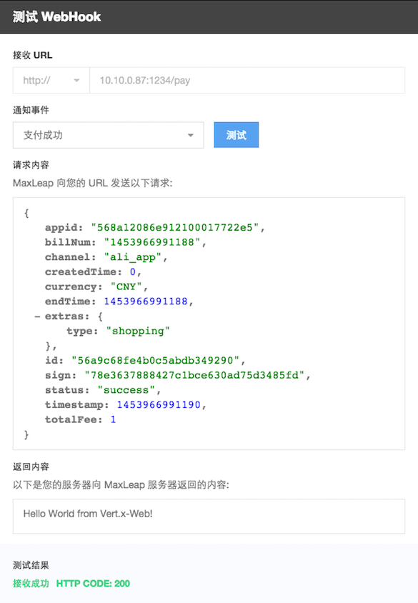

# 支付管理
##简介
###什么是 MaxLeap 支付管理

支付管理是 MaxLeap 提供的在线支付功能，目前提供支付宝的接入配置。

###为何需要 MaxLeap 支付管理

MaxLeap 打通了在线支付相关的流程，并提供交易信息查看，Webhook 通知等功能，帮您屏蔽了很多琐碎的流程，让您更能关注于自己的核心业务。

##交易管理
在“交易列表”中，我们可以查看当前 app 中发生的交易记录：

##渠道配置
在“渠道配置”中，我们可以配置相应的支付渠道（目前仅支持支付宝）：

##Webhook
为了便于客户系统或者第三方系统处理客户的交易信息， MaxPay 支持 Webhooks 功能，可以按照客户要求把特定的事件结果推送到指定的地址以便于客户做后续处理。

###新增 Webhook
点击页面右上角的“新增 Webhook”按钮可以创建一个 Webhook, 在其中可以指定接收事件的 url, 模式以及接收的通知事件：

###编辑 Webhook
在 Webhook 列表中，点击“编辑”图标可以编辑该条 Webhook。

###测试 Webhook
在 Webhook 列表中，点击“测试”图标可以测试该条 Webhook 是否配置成功：

###切换 Webhook 模式
Webhooks 支持 Test 模式和 Live 模式，Test 模式为测试模式，即可以在MaxPay 控制台发送测试数据测试接收URL是否正常；Live 模式为生产环境，即正常交易记录会通知至该URL。
在 Webhook 列表中， 点击对应的模式按钮即可切换模式：

###删除 Webhook
如果一个 Webhook 不再使用，可以点击 Webhook 列表中的“删除”图标来删除它。