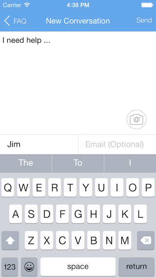

# 安装SDK

1. 下载并解压缩 SDK

	请确认您使用的是Xcode最新版本（5.0+），目标平台为iOS 6.0 或者更高版本。

	<a class="download-sdk" href="https://raw.githubusercontent.com/LeapAppServices/LeapCloud-SDK-Release/master/iOS/v1.5.0/LeapCloudAll-v1.5.0.zip">下载SDK</a>

2. 添加SDK到您的应用

	将下载的 `LeapCloud.framework` 拖至Xcode项目目标文件夹下。确保已勾选“Copy items to destination’s group folder”的复选框。
	
	<p class="image-wrapper">
	

	按照同样的方法把 `LCHelpCenter.embeddedframework` 拖到 Xcode 项目中。

3. 添加依赖

	点击Targets→应用名→“Build Phases”栏。</br>
	将“Link Binary With Libraries”如下图展开。
	
	<p class="image-wrapper">
	
	
    确保“Enable Modules (C and Objective-C)” 和 “Link Frameworks Automatically”的生成设置为Yes。
    
    <p class="image-wrapper">
    
    
	点击“Link Binary With Libraries”左下角+号按钮，添加下列框架：
	
	StoreKit.framework</br>
	MobileCoreServices.framework</br>
	CoreTelephony.framework</br>
	SystemConfiguration.framework</br>
	libsqlite3.dylib</br>
	libz.dylib</br>

# 连接云端应用

打开AppDelegate.m文件，并将如下import添加到文件顶部：

```objc
#import <LeapCloud/LeapCloud.h>
```

然后将以下代码复制到 `application:didFinishLaunchingWithOptions:` 方法中：

```objc
[LeapCloud setApplicationId:@"your_application_id" clientKey:@"your_client_id"];
```

把 `your_application_id` 和 `your_client_id ` 替换成您自己的 LeapCloud 应用的。

接下来启用 HelpCenter 模块:

```
#import <LCHelpCenter/LCHelpCenter.h>

- (BOOL)application:(UIApplication *)application didFinishLaunchingWithOptions:(NSDictionary *)launchOptions
{
	[LeapCloud setApplicationId:@"your_application_id" clientKey:@"your_client_key"];
	[LCHelpCenter install];
}
```

编译并运行！

# 快速测试

1. 测试是否可以连接到 LeapCloud 服务器

	在 `appDelegate.m` 的 `application:didFinishLaunchingWithOptions:` 方法中加入以下代码：


	```objc
	#import <LeapCloud/LeapCloud.h>

	- (BOOL)application:(UIApplication *)application didFinishLaunchingWithOptions:(NSDictionary *)launchOptions
	{
		[LeapCloud setApplicationId:@"your_application_id" clientKey:@"your_client_key"];

		// 创建一条数据
		LCObject *testObject = [LCObject objectWithClassName:@"Person"];
		testObject[@"foo"] = @"bar";
		[LCDataManager saveObjectInBackground:testObject block:nil];
	}
	```

	这段代码目的是在云端创建一条类名为 `Person` 的数据。如果云端还没有 `Person` 这个类，则会先创建这个类，然后再插入数据。

	运行您的应用。然后可以在 Dev Center -> Data 中看到刚创建的数据。

	

2. 检测 HelpCenter 模块是否可以正常使用：
	
	在 `ViewController.m` 的 `viewDidAppear:` 方法中添加以下代码：
	
	```
	[[LCHelpCenter sharedInstance] showFAQs:self];
	```
	
	运行配置好的模板项目，您会看到以下界面：
	
	
	
	新应用的 FAQ 会有 通用(General)、支付(Billing)、隐私(Privacy) 三个部分，如果此界面中显示这三个部分，说明与云端应用 FAQ 连接正常。
	
	在 FAQ 界面右上角有一个“反馈”按钮，按下这个按钮会进入应用反馈界面，如下：
	
	
	
	接下来填写问题简要描述和名字，点击右上角“发送”按钮就会把消息发送到服务器了。发送完成后会收到一条自动回复，这说明 HelpCenter 模块已经集成好了。
	
	
	
	在 LeapCloud 网站上的 Support -> App Issues -> New Issues 中可以看到这条反馈。
